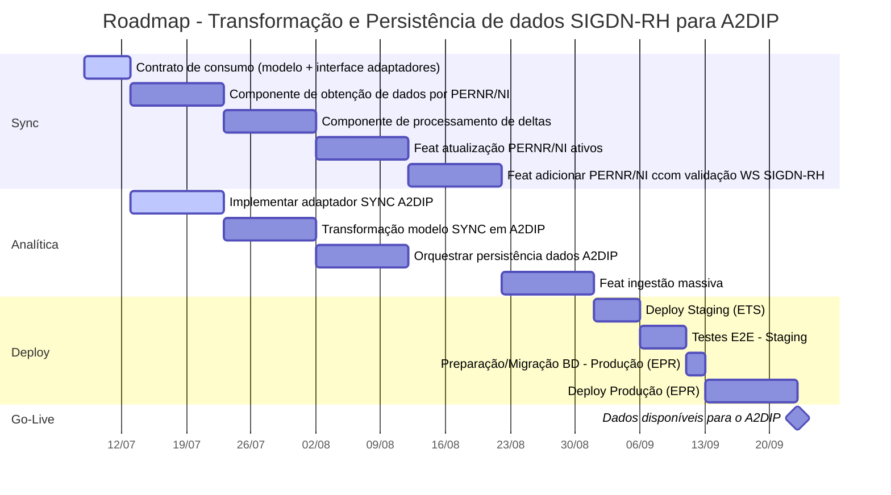

# Plataforma de Integração de Informação das Pessoas

## Index

- [Plataforma de Integração de Informação das Pessoas](#plataforma-de-integração-de-informação-das-pessoas)
  - [Index](#index)
  - [📅 Roadmap](#-roadmap)
  - [🛠️ Development Environment](#️-development-environment)
    - [📁 Dev Container Specs](#-dev-container-specs)
    - [🚀 Getting Started](#-getting-started)
      - [Requirements](#requirements)
      - [Steps](#steps)
  - [🚀 Running Benchmarks](#-running-benchmarks)
    - [Execution Steps](#execution-steps)
    - [Viewing Results](#viewing-results)
  - [🤝 Contributing](#-contributing)

## 📅 Roadmap

Plano de curto prazo até à próxima entrega.



## 🛠️ Development Environment

This project is configured to run in a [Dev Container](https://containers.dev/) environment using Visual Studio Code and the Dev Containers extension. This setup ensures a consistent and reproducible development experience across different machines.

### 📁 Dev Container Specs

The container is defined in `.devcontainer/devcontainer.json` and uses a Docker Compose setup with the following structure:

- **Primary service**: `app`
- **Workspace folder**: `/workspaces/${localWorkspaceFolderBasename}`
- **PostgreSQL** is included and exposed via Docker Compose
- **Post-creation script**: Automatically installs .NET tools (`.devcontainer/script/install-dotnet-tools.sh`)

### 🚀 Getting Started

#### Requirements

- [Docker](https://docs.docker.com/get-docker/)
- [Visual Studio Code](https://code.visualstudio.com/)
- [Dev Containers extension](https://marketplace.visualstudio.com/items?itemName=ms-vscode-remote.remote-containers)

#### Steps

1. **Clone the repository**

   ```bash
   git clone https://devops-01.marinha.pt/marinha-si/pessoas-integracao.git
   cd pessoas-integracao
   ```

2. **Configure environment variables**:

   Create a `.env` file in the `.devcontainer` folder based on `.env.example`:

   ```bash
   cp .devcontainer/.env.example .devcontainer/.env
   ```

   Fill in the required values:
   - `DB_PASSWORD`: Database password
   - `READ_API_KEY`: API key for read operations
   - `WRITE_API_KEY`: API key for write operations
   - `APP_SUB_PATH`: Application sub-path (if applicable)
   - `SONARQUBE_CI_TOKEN`: SonarQube CI token for full scan via development environment
   - `SONARQUBE_USER_TOKEN`: SonarQube user token for connected mode in development environment
   - `SONAR_HOST_URL`: SonarQube server URL
   - `PROXY`: Proxy URL (required if your network uses a proxy)
   - `NO_PROXY`: Comma-separated list of hosts that should bypass the proxy (e.g., `.marinha.pt,localhost,127.0.0.1,host.docker.internal`)

3. **Open in VS Code**:
   - Press F1 (or Ctrl+Shift+P) and run:
     `Dev Containers: Open Folder in Container...` Then choose the project folder.

   - VS Code will automatically:
     - Build the dev container
     - Mount the project
     - Install tools and extensions

## 🚀 Running Benchmarks

This project uses [BenchmarkDotNet](https://benchmarkdotnet.org/) to measure performance.

### Execution Steps

Benchmarks must be run in **Release** mode to ensure the JIT compiler optimizes the code, providing accurate results.

**Navigate to the benchmark project directory:**

 ```bash
  dotnet run -c Release --project tests/Pessoas.Integracao.Benchmarks
 ```

### Viewing Results

Once the execution is complete, BenchmarkDotNet generates detailed reports in the `BenchmarkDotNet.Artifacts/results` folder. You can find the results in:

- **Console:** A summary table is printed directly to the terminal.
- **Files:** CSV, HTML, and Markdown reports are available in the artifacts folder for deeper analysis.
  
## 🤝 Contributing

Contributions are welcome! Please see the [CONTRIBUTING.md](CONTRIBUTING.md) file for guidelines and best practices.
