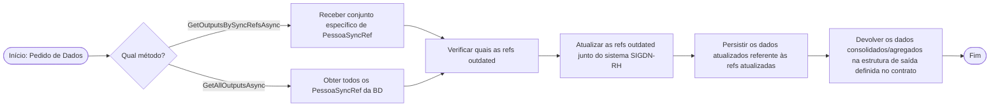

# 001-SYNC: Contrato de integração entre SYNC e consumidores de dados SIGDN-RH

Status: Accepted

## Contexto e Declaração do Problema

O componente Sync é responsável por obter, normalizar e persistir dados do SAP SIGDN-RH. Existem dois consumidores (PIIP e A2DIP) que precisam de aceder a esses dados no seu próprio formato, sem conhecer detalhes do SAP ou da infraestrutura do Sync.
Os modelos `ZhrS*` viviam na `Infrastructure` do Sync, o que impedia a sua utilização como contrato estável entre componentes.

## Opções Consideradas

- **Promover modelos `ZhrS*` para `Application` e definir contrato de saída no Sync (`IZhrOutput` + `IZhrOutputProvider`)**
- **`IZhrSyncAdapter<TTarget>` genérico**
- **Contrato definido pelo consumidor**

## Resultado da Decisão

**Opção escolhida:** "Promover modelos `ZhrS*` para `Application` e definir contrato de saída no Sync (`IZhrOutput` + `IZhrOutputProvider`)", pois o Sync é o produtor dos dados e deve controlar o modelo que expõe, e a responsabilidade de transformação e persistência é do consumidor, não do Sync. O `IZhrOutputProvider` é um ponto de acesso aos dados normalizados, não um adaptador de transformação.

### Implementation Details

#### 1. Promoção dos modelos ZhrS* para Application

Os modelos `ZhrSBaseModel`, `ZhrSBaseModelOutput` e todos os tipos concretos (`ZhrSAptidao`, `ZhrSPessoais`, etc.) são promovidos de `Infrastructure` para `Application/Models`, tornando-os independentes de detalhes de persistência.

#### 2. Contrato de saída definido no Sync

O Sync define o contrato que os consumidores utilizam.

`IZhrOutput` — interface que representa a vista agregada por `Ni` de todos os dados SAP persistidos:

```csharp
public interface IZhrOutput
{
    public string Ni { get; init; }
    public string ExternalId { get; init; }
    public DateTimeOffset? UpdateAt { get; init; }
    public IList<ZhrSAptidao>? Aptidoes { get; set; }
    public IList<ZhrSPessoais>? Pessoais { get; set; }
    public IList<ZhrSFamilia>? Familias { get; set; }
    public IList<ZhrSOutrosdados>? OutrosDados { get; set; }
    public IList<ZhrSDeficiencias>? Deficiencias { get; set; }
}
```

`IZhrOutputProvider` — ponto de acesso aos dados normalizados do SIGDN-RH:

```csharp
public interface IZhrOutputProvider
{
    Task<IReadOnlyList<IZhrOutput>> GetOutputsBySyncRefsAsync(IReadOnlyList<PessoaSyncRef> pessoaSyncRefs, CancellationToken ct);
    Task<IReadOnlyList<IZhrOutput>> GetAllOutputsAsync(CancellationToken ct);
}
```

Os consumidores obtêm os dados invocando `IZhrOutputProvider`, nunca acedendo directamente à infraestrutura do Sync. A implementação é resolvida via DI em runtime.

Os métodos disponíveis no contrato são:

- `GetOutputsBySyncRefsAsync`: Devolve a estrutura que agrega os dados SAP persistidos (por `Ni`) para as referências de sincronização de pessoas (`PessoaSyncRef`) especificadas.
- `GetAllOutputsAsync`: Devolve a estrutura que agrega todos os dados SAP persistidos no componente Sync, sem filtrar por referências específicas.

### Comportamento dos Métodos

O comportamento de cada método é muito idêntico, com a única diferença a residir no conjunto de `PessoaSyncRef` a processar. O fluxo converge para um único workflow após a obtenção das referências:

- `GetOutputsBySyncRefsAsync`: Atua para um conjunto de `PessoaSyncRef` especificado pelo cliente.
- `GetAllOutputsAsync`: Numa primeira fase, obtém todos os `PessoaSyncRef` da base de dados e depois volta ao percurso único do workflow.

O workflow único após a obtenção das referências é o seguinte:

1. Verificar quais as refs outdated.
2. Atualizar as refs outdated junto do sistema SIGDN-RH.
3. Persistir os dados atualizados referente às refs atualizadas.
4. Devolver os dados consolidados/agregados na estrutura de saída definida no contrato.



Em ambos os métodos, é devolvida a estrutura que agrega os dados SAP persistidos no componente Sync.

#### 3. Fronteiras entre assemblies

| Assembly              | Responsabilidade                                                |
| --------------------- | --------------------------------------------------------------- |
| `Sync.Application`    | Define `IZhrOutput`, `IZhrOutputProvider` e `PessoaSyncRef`     |
| `Sync.Infrastructure` | Implementa `IZhrOutputProvider` — referencia `Sync.Application` |
| `ConsumidorX`         | referencia `Sync.Application` para fazer uso do contrato        |
| Host (por definir)    | Regista `IZhrOutputProvider` via DI                             |

O Sync não conhece os consumidores. Os consumidores não conhecem o SAP nem a infraestrutura do Sync. O único ponto de acoplamento é o contrato (`IZhrOutput` + `IZhrOutputProvider`).

### Consequências

#### Positivas

- Modelos `ZhrS*` estáveis como contrato partilhado interno
- Consumidores isolados da infraestrutura do Sync — dependem apenas de `Sync.Application`
- Suporta push diário por delta e pull on-demand sobre o mesmo contrato
- Novos consumidores não implicam alterações no Sync
- A arquitectura adoptada isola completamente o SAP SIGDN-RH atrás do Sync. No cenário de migração do SIGDN-RH para SAP S/4HANA (ou outro sistema externo), o impacto fica contido:
  - `Sync.Infrastructure`: Substituída — nova camada de integração com o sistema destino
  - `Sync.Application/Models`: Potencialmente revisto se o modelo de dados mudar significativamente
  - `IZhrOutput`: Revisto apenas se os dados expostos mudarem
  - Implementações dos consumidores: Impacto proporcional às alterações no `IZhrOutput`
  - Modelos de destino: Sem impacto — são independentes do sistema de origem
- A substituição do sistema externo é uma decisão interna ao Sync. Os consumidores só são afectados se o contrato (`IZhrOutput`) mudar e, mesmo nesse caso, a alteração é localizada ao transformer de cada consumidor, não à sua lógica de negócio. Esta propriedade foi um factor de decisão consciente na adopção desta arquitectura.

#### Negativas

- `Infrastructure` passa a depender de `Application`.
