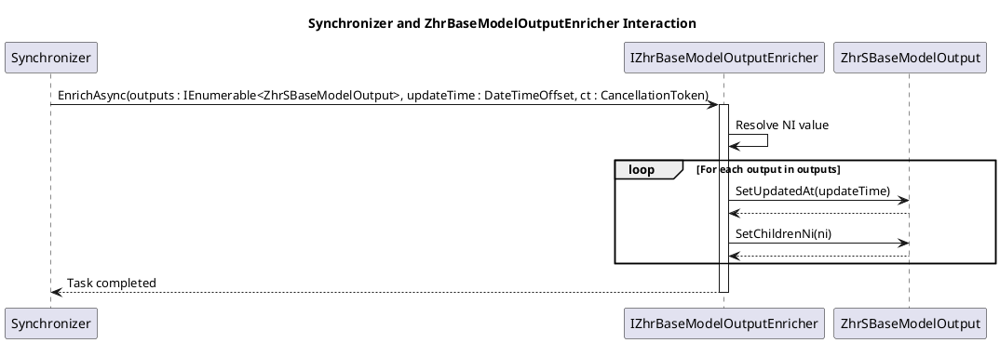

# 002-SYNC: Lógica Centralizada de Enriquecimento para Sincronizadores

**Estado:** Proposto

## Contexto e Declaração do Problema

Os sincronizadores necessitam de enriquecer os modelos de saída antes da sua persistência, garantindo a atualização do campo `UpdatedAt` e a propagação do `Ni` para os modelos filhos através de `SetChildrenNi`.

Atualmente, esta lógica teria de ser implementada em cada sincronizador, originando duplicação de código, aumento do esforço de manutenção e necessidade de validar o mesmo comportamento em múltiplas implementações. A decisão consiste em definir um mecanismo que centralize este enriquecimento, preservando a responsabilidade dos sincronizadores pela orquestração do processo de sincronização.

## Opções Consideradas

- Manter a implementação distribuída pelos sincronizadores.
- Centralizar a lógica numa classe base.
- Introduzir um componente de enriquecimento (`IZhrBaseModelOutputEnricher`).

## Resultado da Decisão

**Opção escolhida:** Introduzir um componente de enriquecimento (`IZhrBaseModelOutputEnricher`).

Esta abordagem centraliza a lógica comum de enriquecimento dos modelos de saída, eliminando duplicação entre sincronizadores e promovendo uma separação clara de responsabilidades:

- Os sincronizadores continuam responsáveis pela obtenção dos dados e pela orquestração do processo.
- O componente `IZhrBaseModelOutputEnricher` fica responsável por aplicar o enriquecimento comum aos modelos.

O instante de atualização (`updateTime`) é determinado pelo sincronizador e fornecido explicitamente ao componente, garantindo consistência temporal durante toda a execução da sincronização.

### Diagrama de Sequência

### Consequências

#### Positivas

- Centraliza a lógica comum de enriquecimento dos modelos.
- Elimina duplicação entre sincronizadores.
- Reduz o esforço de manutenção e de testes.
- Promove uma separação clara entre a orquestração da sincronização e o enriquecimento dos modelos.
- Garante que todos os modelos de uma sincronização recebem o mesmo `updateTime`.

#### Negativas

- Introduz uma dependência adicional nos sincronizadores.
- Acrescenta um componente à arquitetura, aumentando ligeiramente a complexidade estrutural.

## Referências

- [Architecture Decision Records (ADR)](https://adr.github.io/)
