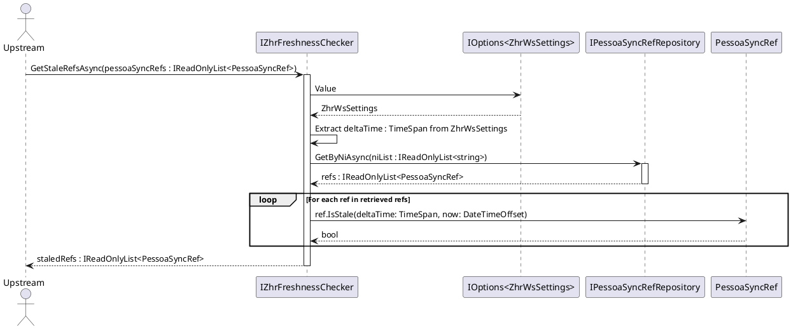

# Implementar o componente `IZhrFreshnessChecker` para verificação de _freshness_ via `IPessoaSyncRefRepository.GetByNiAsync`

Status: Proposed

## Contexto e Declaração do Problema

No processo de sincronização de dados SIGDN-RH, o componente _upstream_ recebe instâncias de `PessoaSyncRef` de um assembly consumidor via _provider_. No entanto, estas instâncias não garantem ter os valores de `SyncState.UpdatedAt` atualizados ou fiáveis provenientes da base de dados. Para determinar se uma pessoa precisa de ser atualizada, é necessário aferir se a data de atualização real na base de dados é anterior a um _threshold_ calculado subtraindo um `deltaTime` (definido nas configurações `ZhrWsSettings`) à data atual.

A opção de utilizar apenas um método de membro em `PessoaSyncRef` para filtrar em memória, assumindo que os `UpdatedAt` nas instâncias recebidas são fiáveis, não é suficiente, pois a fonte da verdade para o `UpdatedAt` deve ser a base de dados, e não os objetos recebidos que podem ter estados obsoletos ou não populados. No entanto, a **regra de negócio** que define o que significa um registo estar _stale_ (desatualizado) face a um `deltaTime` é uma lógica de domínio que deve ser encapsulada.

## Opções Consideradas

- Filtrar em memória utilizando um método de membro (`IsStale`) em `PessoaSyncRef`, assumindo que o `UpdatedAt` nas instâncias recebidas é fiável e passando o `deltaTime` como parâmetro.
- Injetar `IOptions<ZhrWsSettings>` no componente _upstream_, que resolve o `deltaTime` e o passa como parâmetro para o `IZhrFreshnessChecker.GetStaleRefsAsync(refs, deltaTime, ct)`, onde o checker faz a consulta ao repositório.
- Injetar `IOptions<ZhrWsSettings>` na implementação do `IZhrFreshnessChecker`, que resolve internamente o valor de `deltaTime`, consulta a base de dados via `IPessoaSyncRefRepository.GetByNiAsync` para obter os `SyncState.UpdatedAt` fiáveis, e aplica a regra de avaliação de _freshness_ para determinar quais os `PessoaSyncRef` que estão _stale_.

## Resultado da Decisão

Opção escolhida: "Injetar `IOptions<ZhrWsSettings>` na implementação do `IZhrFreshnessChecker`, que resolve internamente o valor de `deltaTime`, consulta a base de dados via `IPessoaSyncRefRepository.GetByNiAsync`, e aplica a regra de avaliação de _freshness_.", porque esta abordagem está alinhada com os princípios de responsabilidade única e encapsulamento, e clarifica a separação de responsabilidades entre a regra de domínio e a orquestração do fluxo:

- **Responsabilidade de Avaliação (Regra de Negócio Pura)**: A regra que define se um `PessoaSyncRef` com um dado `SyncState.UpdatedAt` está _stale_ face a um `deltaTime` e uma data atual é uma regra de domínio. Esta lógica pode (e deve) ser encapsulada num método de membro como `IsStale(TimeSpan deltaTime, DateTimeOffset now)` na entidade `PessoaSyncRef` ou no Value Object `SyncState`. Esta responsabilidade é pura e não conhece a origem do `deltaTime` nem a base de dados; apenas avalia o estado dado os parâmetros.
- **Responsabilidade de Orquestração e Decisão de Fluxo**: Pertence ao componente `IZhrFreshnessChecker`. A sua responsabilidade é garantir que a avaliação de domínio é feita com os dados fiáveis da base de dados (via `IPessoaSyncRefRepository.GetByNiAsync`) e com a configuração correta (via `IOptions<ZhrWsSettings>`), devolvendo ao componente _upstream_ apenas a lista de `PessoaSyncRef` que efetivamente estão _stale_ e necessitam de _refresh_.

Ao injetar `IOptions<ZhrWsSettings>` internamente, o componente `IZhrFreshnessChecker` encapsula a resolução da configuração e o uso do repositório, mantendo o componente _upstream_ focado na sua lógica de negócio e seguindo as boas práticas da camada `Sync`.

### Diagrama de Sequência

### Consequências

- Positivo, porque garante que a verificação de _freshness_ é baseada na fonte da verdade (base de dados), evitando processamento desnecessário de dados que já estão atualizados.
- Positivo, porque a implementação de `IZhrFreshnessChecker` encapsula a lógica de chamada ao repositório `IPessoaSyncRefRepository.GetByNiAsync` e a resolução de `IOptions<ZhrWsSettings>`, mantendo o componente _upstream_ limpo de dependências extras e parâmetros excessivos.
- Positivo, porque mantém a separação de responsabilidades: a regra de domínio (`IsStale`) vive na entidade/Value Object, enquanto a orquestração (buscar dados fiáveis e aplicar a regra) vive no serviço de aplicação.
- Negativo, porque introduz uma chamada ao repositório para obter os `UpdatedAt`, adicionando um pequeno overhead em comparação com uma filtragem puramente em memória, mas este overhead é necessário para a correção dos dados.
