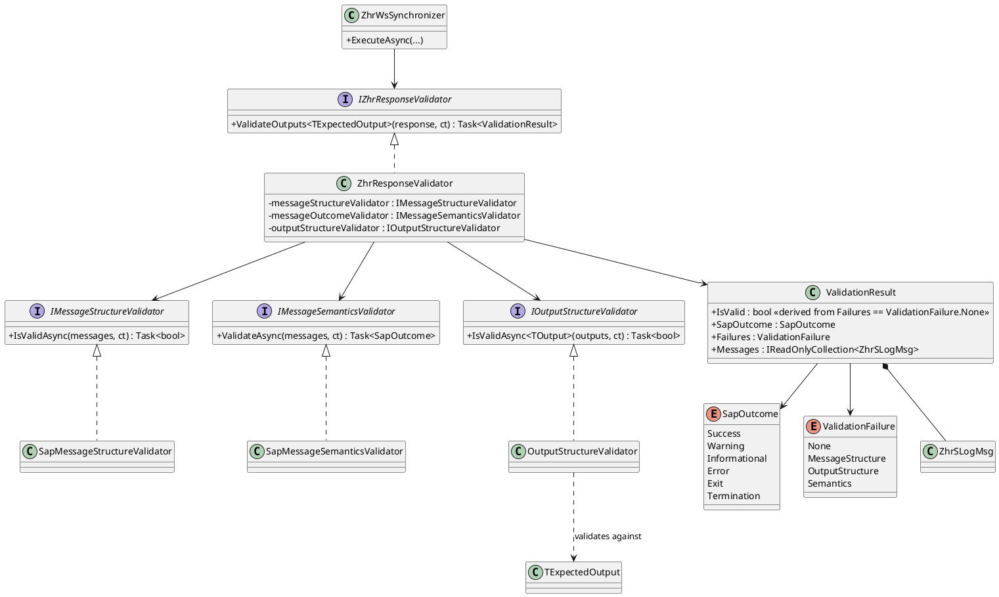

# Validação Centralizada de Respostas SAP e Conformidade de Estruturas de Output

Status: Proposto

## Contexto e Declaração do Problema

Os sincronizadores ZHR consomem serviços SOAP SAP que retornam simultaneamente mensagens de execução (sucesso, aviso, erro, abort) e estruturas de dados específicas para cada operação (por exemplo, `ZhrSAptidaoOutput`).

Atualmente, os sincronizadores assumem implicitamente que a resposta recebida é válida e compatível com a estrutura esperada. No entanto, alterações no contrato SAP, problemas de serialização, ou respostas de erro reportadas através das mensagens SAP podem conduzir à persistência de dados incompletos ou inconsistentes.

A questão é: **como garantir, de forma centralizada e reutilizável, que uma resposta SAP é simultaneamente válida do ponto de vista funcional (mensagens SAP) e estrutural (conformidade com o tipo de output esperado) antes de ser processada pelos sincronizadores?**

O âmbito desta decisão abrange todos os componentes de sincronização ZHR e os contratos de output devolvidos pelos serviços SAP.

## Opções Consideradas

- Sem validação centralizada
- Validação específica implementada em cada sincronizador
- Componente central de validação de respostas SAP injetado nos sincronizadores

## Resultado da Decisão

**Opção escolhida:** "Componente central de validação de respostas SAP injetado nos sincronizadores", porque permite concentrar toda a lógica de validação técnica num único ponto, reduz a duplicação de código, facilita a deteção de alterações de contrato SAP e mantém os sincronizadores focados exclusivamente na sua responsabilidade de orquestração.

### Decisão

Será introduzido um componente único exposto através da interface:

```csharp
public interface IZhrResponseValidator
{
    Task<ValidationResult> ValidateOutputs<TExpectedOutput>(IZhrWsBaseResponse? response, CancellationToken ct);
}
```

Os sincronizadores passam a depender desta interface:

```csharp
public class ZhrWsAptidaoSynchronizer(
    IZhrWsGenericClient client,
    IZhrChildrenAggregator childrenAggregator,
    IZhrResponseValidator validator)
{
    ...
}
```

A utilização será realizada da seguinte forma:

```csharp
var roots = await client.CallAsync(...);

ValidationResult result = await validator.ValidateOutputs<ZhrSAptidaoOutput>(roots, ct);

//...restante lógica de decisão face aos resultados da validação
```

O componente executará internamente três validações independentes, delegadas a validadores específicos:

- `IMessageStructureValidator`
  ⇒ "A estrutura das mensagens SAP é válida?"

- `IMessageSemanticsValidator`
  ⇒ "O que significam as mensagens SAP?"

- `IOutputStructureValidator`
  ⇒ "O output devolvido está em conformidade com TExpectedOutput?"

- `ZhrResponseValidator`
  ⇒ "Dados todos os resultados de validação, qual é o estado final de validação?"

#### 1. Validação da Estrutura das Mensagens SAP (`IMessageStructureValidator` / `SapMessageStructureValidator`)

Verifica se a estrutura das mensagens SAP devolvidas é válida, validando a existência e formato dos campos obrigatórios:

- `Numsap`
- `Ni`
- `Msgid`
- `Msgno`
- `Msgty`
- `Message`

Exemplo:

```csharp
public interface IMessageStructureValidator
{
    Task<bool> IsValidAsync(IReadOnlyList<ZhrSLogMsg> logMessages, CancellationToken ct);
}
```

#### 2. Validação da Semântica das Mensagens SAP (`IMessageSemanticsValidator` / `SapMessageSemanticsValidator`)

Interpreta as mensagens devolvidas pelo SAP e determina o resultado funcional da operação (SapOutcome).

Exemplo:

```csharp
public interface IMessageSemanticsValidator
{
    Task<SapOutcome> ValidateAsync(IReadOnlyList<ZhrSLogMsg> logMessages, CancellationToken ct);
}
```

Tipos suportados e mapeamento para `SapOutcome`:

- **`S` = Success (Sucesso) -> `Success`:** A operação foi concluída de forma normal e correta. Os dados foram validados e processados com êxito pelo sistema.
- **`I` = Information (Informação) -> `Informational`:** Uma mensagem puramente informativa. Não interrompe o processamento e serve apenas para dar contexto ao utilizador (ex: "O cliente pertence à Região Norte").
- **`W` = Warning (Aviso) -> `Warning`:** Alerta para uma situação irregular ou de risco potencial, mas que não impede o negócio de continuar (ex: "Data de entrega no passado" ou "Limite de crédito quase atingido"). O sistema permite avançar se o utilizador ou o código confirmarem a ação.
- **`E` = Error (Erro) -> `Error`:** Erro de validação de dados ou violação de regras de negócio (ex: "Material não existe" ou "Campo obrigatório em falta"). Impede a conclusão da tarefa e bloqueia a gravação na base de dados até ser corrigido.
- **`A` = Abort (Cancelamento/Terminação) -> `Exit`:** Um erro grave que força a interrupção imediata do processamento da transação atual, cancelando todas as alterações pendentes daquela execução específica.
- **`X` = System Exception (Exceção de Sistema) -> `Termination`:** Um erro técnico crítico que causa uma terminação abrupta do programa no servidor (gerando um _Short Dump_ na transação `ST22`). Ocorre quando o sistema encontra uma instrução impossível de processar, como uma divisão por zero ou falta de memória.

Regras de severidade:

`Termination > Exit > Error > Warning > Informational > Success`

Casos com mensagens `Error`, `Exit` ou `Termination` originam falha da validação.

A especificação técnica e o comportamento esperado para cada um destes tipos de mensagem estão documentados nos canais oficiais da SAP:

- **Mensagens do Sistema e Estrutura SY-MSGTY:** O comportamento padrão das mensagens `S, I, W, E, A, X` no ecossistema ABAP pode ser consultado no [SAP Help Portal - ABAP Message Handling](https://help.sap.com/docs/SUPPORT_CONTENT/abap/3353524182.html?locale=en-US).

#### 3. Validação da Estrutura de Output (`IOutputStructureValidator` / `OutputStructureValidator`)

Verifica se os objetos recebidos cumprem o contrato esperado pelo sincronizador (conformidade recursiva com a hierarquia de objetos, propriedades e coleções obrigatórias).

Exemplo:

```csharp
public interface IOutputStructureValidator
{
    Task<bool> IsValidAsync<TOutput>(IReadOnlyList<ZhrSBaseModelOutput> outputs, CancellationToken ct);
}
```

A validação é realizada recursivamente sobre a estrutura esperada:

```markdown
ZhrSAptidaoOutput
├─ Numsap
├─ Ni
└─ <Children>[]
```

São verificadas:

- Existência do output.
- Compatibilidade com o tipo esperado.
- Existência de propriedades obrigatórias.
- Existência de coleções obrigatórias.
- Existência de estruturas filhas obrigatórias.
- Conformidade da hierarquia de objetos.

O objetivo principal é detetar situações de:

- Contract drift.
- Alterações de nomenclatura em campos SAP.
- Mapeamentos SOAP incompletos.
- Estruturas parciais ou inválidas.

IMessageStructureValidator
⇒ "Is the SAP message structure valid?"

IMessageSemanticsValidator
⇒ "What do the SAP messages mean?"

IOutputStructureValidator
⇒ "Does the returned output comply with TExpectedOutput?"

ZhrResponseValidator
⇒ "Aggregate everything into a ValidationResult"

Structure validators answer: "Is the response structurally valid?"
Semantic validator answers: "What is the SAP meaning of the response?"
Response validator answers: "Given all validation results, what is the final validation state?"

#### 4. Validação da resposta (`ZhrResponseValidator`)

O componente `ZhrResponseValidator` é o responsável por orquestrar as três validações anteriores — estrutura das mensagens SAP, semântica das mensagens SAP e estrutura de output — e consolidar os seus resultados num único objeto `ValidationResult`. Este resultado sintetiza o estado funcional da operação (via `SapOutcome`), as falhas detetadas em cada camada de validação (via `Failures`) e as mensagens originais devolvidas pelo SAP (via `Messages`).

`ValidateOutputs` retorna um `ValidationResult` (que contém `IsValid`, `SapOutcome`, `Failures` e `Messages`). É responsabilidade do sincronizador analisar o `ValidationResult.IsValid` para permitir ou impedir a continuação do processamento.

Critérios:

| SapOutcome    | Failures                                         | IsValid | Interpretation                                                                                         |
| ------------- | ------------------------------------------------ | ------- | ------------------------------------------------------------------------------------------------------ |
| Success       | None                                             | ✅      | Resposta totalmente válida. O processamento pode continuar.                                            |
| Warning       | None                                             | ✅      | Resposta válida com avisos do SAP. O processamento pode continuar de acordo com a política de negócio. |
| Informational | None                                             | ✅      | Resposta válida com mensagens informativas do SAP.                                                     |
| Error         | Semantics                                        | ❌      | O SAP processou o pedido mas retornou um erro de negócio.                                              |
| Exit          | Semantics                                        | ❌      | O SAP abortou o processamento intencionalmente.                                                        |
| Termination   | Semantics                                        | ❌      | O SAP encontrou uma falha grave/do sistema.                                                            |
| Success       | MessageStructure                                 | ❌      | O SAP indica sucesso, mas a estrutura das mensagens é inválida.                                        |
| Warning       | MessageStructure                                 | ❌      | O SAP retornou avisos, mas a estrutura das mensagens é inválida.                                       |
| Informational | MessageStructure                                 | ❌      | O SAP retornou mensagens informativas, mas a estrutura das mensagens é inválida.                       |
| Success       | OutputStructure                                  | ❌      | O SAP indica sucesso, mas a estrutura de output não está em conformidade com o contrato esperado.      |
| Warning       | OutputStructure                                  | ❌      | O SAP retornou avisos, mas a estrutura de output é inválida.                                           |
| Informational | OutputStructure                                  | ❌      | O SAP retornou mensagens informativas, mas a estrutura de output é inválida.                           |
| Success       | MessageStructure \| OutputStructure              | ❌      | Múltiplas falhas de validação estrutural detetadas.                                                    |
| Error         | Semantics \| OutputStructure                     | ❌      | O SAP retornou um erro e a estrutura de output é inválida.                                             |
| Error         | Semantics \| MessageStructure                    | ❌      | O SAP retornou um erro e a estrutura das mensagens é inválida.                                         |
| Error         | Semantics \| MessageStructure \| OutputStructure | ❌      | Múltiplas falhas de validação. A resposta não pode ser confiada.                                       |

Invariantes:

| Regra                      | Explicação                       |
| -------------------------- | -------------------------------- |
| Failures == None           | IsValid = true                   |
| Failures != None           | IsValid = false                  |
| SapOutcome = Success       | Não garante validade             |
| SapOutcome = Warning       | Não garante validade             |
| SapOutcome = Informational | Não garante validade             |
| SapOutcome = Error         | Deve implicar falha de Semantics |
| SapOutcome = Exit          | Deve implicar falha de Semantics |
| SapOutcome = Termination   | Deve implicar falha de Semantics |
| Falha em MessageStructure  | Sempre invalida a resposta       |
| Falha em OutputStructure   | Sempre invalida a resposta       |

### Exemplos Representativos

#### Resposta válida

```plaintext
IsValid    = true
SapOutcome = Success
Failures   = None
```

#### Resposta válida com avisos

```plaintext
IsValid    = true
SapOutcome = Warning
Failures   = None
```

#### Erro do SAP

```plaintext
IsValid    = false
SapOutcome = Error
Failures   = Semantics
```

#### Desvio de contrato detetado

```plaintext
IsValid    = false
SapOutcome = Success
Failures   = OutputStructure
```

#### Múltiplas falhas

```plaintext
IsValid    = false
SapOutcome = Error
Failures   = Semantics | OutputStructure
```

#### 5. Diagrama Estrutural com definição de interfaces, classes, estruturas de dados e as suas relações



### Consequências

#### Positivas

- Elimina duplicação de lógica de validação nos sincronizadores.
- Centraliza a interpretação das mensagens SAP.
- Deteta alterações de contrato SAP antes da persistência de dados.
- Mantém os sincronizadores simples e focados na orquestração.
- Facilita a evolução futura das regras de validação.
- Promove consistência entre todos os serviços ZHR.
- Permite adicionar novas validações sem alterar os sincronizadores existentes.
- Isola o conhecimento técnico sobre estruturas SAP num único componente.

#### Negativas

- Introduz uma camada adicional no fluxo de processamento.
- Requer manutenção contínua das regras de validação estrutural.
- Pode provocar falhas imediatas após alterações introduzidas nos contratos SAP até que os modelos sejam atualizados.
- A implementação baseada em reflexão pode introduzir algum custo de execução, embora negligenciável face ao custo das chamadas SAP.
