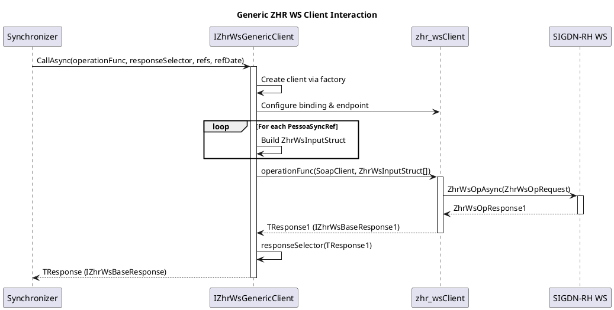

# Cliente Genérico para Serviços Web ZHR

Status: Proposto

## Contexto e Declaração do Problema

O projeto `Pessoas.Integracao.Sync` necessita de consumir múltiplos serviços web SOAP do sistema SIGDN-RH (ZHR Web Services), incluindo operações como `Aptidao`, `AtribOrg`, `PersonalData`, `ExamesMed`, `Mobilidades`, entre outras.

Cada um destes serviços web segue um padrão comum de contrato SOAP:

- Recebem um array de `ZhrWsInputStruct` como entrada, contendo `Ni`, `Numsap`, `Empresa` e `Dtreferencia`.
- Retornam uma resposta estruturada com mensagens de log (`ZhrSLogMsg[]`) e dados de saída (`ZhrSOpOutput[]`).
- Utilizam um cliente gerado a partir do WSDL (`zhr_wsClient`) que herda de `ClientBase<zhr_ws>`.

Sem uma abordagem genérica, cada operação de serviço web exigiria a sua própria implementação de cliente, resultando em:

- Duplicação de código de configuração de binding, endpoint e gestão de ciclo de vida do cliente.
- Dificuldade em manter consistência na gestão de erros, timeouts e cancellation tokens.
- Esforço adicional de manutenção quando ocorrem alterações nos padrões de contrato ou na configuração de infraestrutura.

A decisão consiste em definir um padrão de cliente genérico que abstrai a complexidade comum dos serviços web ZHR, permitindo que cada operação específica seja tratada de forma flexível e reutilizável.

## Opções Consideradas

- Implementar um cliente específico para cada operação de serviço web (`AptidaoClient`, `AtribOrgClient`, `PersonalDataClient`, etc.)
- Criar uma classe base comum para todos os clientes ZHR
- Introduzir um cliente genérico (`IZhrWsGenericClient` / `ZhrWsGenericClient`) que aceite a operação e o seletor de resposta como parâmetros

## Resultado da Decisão

**Opção escolhida:** "Introduzir um cliente genérico (`IZhrWsGenericClient` / `ZhrWsGenericClient`)", porque esta abordagem:

- Centraliza a gestão do ciclo de vida do cliente SOAP (`zhr_wsClient`), bindings e endpoints.
- Elimina a duplicação de código de configuração e gestão de recursos entre múltiplos clientes.
- Permite a reutilização da mesma implementação para todas as operações ZHR, independentemente da especificidade dos dados de entrada ou saída.
- Mantém a flexibilidade para lidar com diferentes operações e formatos de resposta através de delegação via `Func`.

O cliente genérico expõe o seguinte método:

```csharp
Task<TResponse?> CallAsync<TResponse1, TResponse>(
    Func<zhr_wsClient, ZhrWsInputStruct[], Task<TResponse1?>> zhrSOperation,
    Func<TResponse1, TResponse?> responseSelector,
    IReadOnlyCollection<PessoaSyncRef> pessoaSyncRefs,
    DateOnly? zhrReferenceDate = null,
    CancellationToken ct = default
)
where TResponse1 : IZhrWsBaseResponse1
where TResponse : IZhrWsBaseResponse;
```

### Explicação dos Parâmetros

#### `zhrSOperation` (ZhrOperation)

Este parâmetro é um `Func<zhr_wsClient, ZhrWsInputStruct[], Task<TResponse1?>>` que especifica qual operação do serviço web será chamada. Permite que o cliente genérico delegue a execução específica da operação SOAP, mantendo a abstração genérica.

Exemplo de uso:

```csharp
async Task<ZhrWsAptidaoResponse1?> CallAptidao(zhr_wsClient client, ZhrWsInputStruct[] inputs)
{
    return await client.ZhrWsAptidaoAsync(new zhr_ws.ZhrWsAptidao { ZhrWsOp = new zhr_ws.ZhrWsOp { Input = inputs } });
}
```

Esta abordagem segue o padrão de estratégia, onde a operação específica é injetada como uma função, permitindo que o cliente genérico não precise conhecer os detalhes de cada operação SOAP.

#### `responseSelector`

Este parâmetro é um `Func<TResponse1, TResponse?>` que permite especificar a transformação da resposta bruta do SOAP (`TResponse1 : IZhrWsBaseResponse1`) para a resposta específica do domínio (`TResponse : IZhrWsBaseResponse`).

Todas as respostas SOAP seguem uma estrutura de dados equivalente com `ZhrWsOpResponse1` que contém `ZhrWsOpResponse`, que por sua vez contém `ZhrSLogMsg[]` e `ZhrSOpOutput[]`. O `responseSelector` permite extrair e transformar os dados relevantes para o modelo de domínio específico, mantendo o desacoplamento entre o contrato SOAP e os modelos de domínio.

Exemplo de uso:

```csharp
ZhrWsAptidaoResponse SelectResponse(ZhrWsAptidaoResponse1 response1)
{
    if (response1?.ZhrWsOpResponse?.Output == null || response1.ZhrWsOpResponse.Output.Length == 0)
    {
        return null;
    }

    var response = new ZhrWsAptidaoResponse
    {
        Message = response1.ZhrWsOpResponse.Message,
        Output = response1.ZhrWsOpResponse.Output
    };

    return response;
}
```

#### `pessoaSyncRefs`

Coleção de referências de pessoas a serem processadas, contendo `Ni` e `ExternalId` (Numsap). Estes dados são mapeados para `ZhrWsInputStruct[]` com a empresa e a data de referência.

#### `zhrReferenceDate`

Data de referência opcional que é passada no formato específico que o SIGDN-RH utiliza para retornar dados relacionados com essa data de referência. A formatação é delegada ao componente `IZhrReferenceDateFormatter`, que garante que o formato da data está alinhado com as expectativas do sistema SIGDN-RH.

Se não for fornecida, o campo `Dtreferencia` é enviado como uma string vazia, o que normalmente resulta no retorno dos dados atuais pelo sistema SIGDN-RH.

### Diagrama de Sequência



### Consequências

#### Positivas

- Centraliza a gestão do ciclo de vida do cliente SOAP e a configuração de bindings/endpoints.
- Elimina a duplicação de código entre múltiplos clientes de serviços web ZHR.
- Facilita a manutenção e a evolução da infraestrutura de comunicação com o SIGDN-RH.
- Permite a adição de novas operações de serviço web sem necessidade de criar novos clientes completos.
- Garante consistência na gestão de cancellation tokens e timeouts.
- Desacopla o contrato SOAP dos modelos de domínio através do `responseSelector`.

#### Negativas

- Introduz uma camada de indireção que pode tornar o fluxo de chamada menos óbvio para desenvolvedores novos.
- A complexidade genérica (`TResponse1`, `TResponse`) pode exigir um esforço de aprendizagem inicial para compreender o padrão de transformação de respostas.
- Depuração de erros pode ser mais complexa devido à delegação via `Func`.
