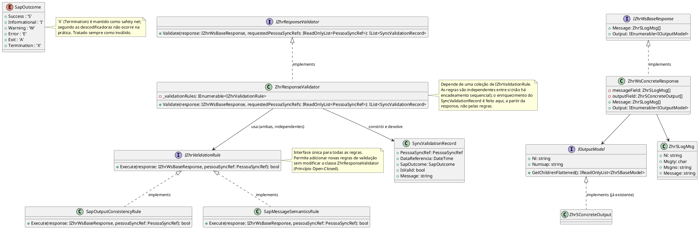

# Validação Centralizada de Respostas SAP por `PessoaSyncRef`

Status: Proposto

## Contexto e Declaração do Problema

Os sincronizadores ZHR consomem serviços SOAP SAP que retornam simultaneamente mensagens de execução (sucesso, aviso, erro, abort) e estruturas de dados específicas para cada operação (por exemplo, `ZhrSAptidaoOutput`).

Atualmente, os sincronizadores assumem implicitamente que a resposta recebida é válida e compatível com a estrutura esperada. No entanto, alterações no contrato SAP, problemas de serialização, ou respostas de erro reportadas através das mensagens SAP podem conduzir à persistência de dados incompletos ou inconsistentes.

A questão é: **como garantir, de forma centralizada e reutilizável, que uma resposta SAP é simultaneamente válida do ponto de vista funcional (mensagens SAP) e estrutural (conformidade com o tipo de output esperado) antes de ser processada pelos sincronizadores?**

O âmbito desta decisão abrange todos os componentes de sincronização ZHR e os contratos de output devolvidos pelos serviços SAP.

**Fora de âmbito:** falhas de transporte/infraestrutura anteriores à validação (timeouts, faults SOAP, exceções lançadas por `client.CallAsync`) não são tratadas por este componente. O `ZhrResponseValidator` assume que já existe uma resposta desserializada com sucesso; falhas nesse passo anterior são da responsabilidade do cliente SOAP e devem ser tratadas antes de a resposta chegar ao validador.

## Opções Consideradas

- Sem validação centralizada
- Validação específica implementada em cada sincronizador
- Componente central de validação de respostas SAP injetado nos sincronizadores

## Resultado da Decisão

**Opção escolhida:** "Componente central de validação de respostas SAP injetado nos sincronizadores", porque permite concentrar toda a lógica de validação técnica num único ponto, reduz a duplicação de código, facilita a deteção de alterações de contrato SAP e mantém os sincronizadores focados exclusivamente na sua responsabilidade de orquestração.

### Decisão

Será introduzido um componente único exposto através da interface `IZhrResponseValidator`.

```csharp
public interface IZhrResponseValidator
{
    IList<SyncValidationRecord> Validate(
        IZhrWsBaseResponse response,
        IReadOnlyList<PessoaSyncRef> requestedPessoaSyncRefs);
}
```

Os sincronizadores passam a depender desta interface:

```csharp
public class ZhrWsSomeSynchronizer(
    // outras dependências
    IZhrResponseValidator validator)
{
    ...
}
```

A utilização será realizada da seguinte forma:

```csharp
var response = await client.CallAsync(...);

IList<SyncValidationRecord> validationRecords = validator.Validate(response, requestedPessoaSyncRefs);

//...restante lógica de decisão face aos resultados da validação
```

### Estrutura das Respostas SAP (`IZhrWsBaseResponse`)

A interface `IZhrWsBaseResponse` identifica todas as respostas SAP consumidas pelos sincronizadores ZHR. Ao contrário de um marker interface puro, expõe o mínimo necessário para que as regras de validação acedam aos dados sem _casting_ para tipos concretos — preservando o Open-Closed Principle: adicionar uma nova resposta SAP não obriga a alterar nenhuma regra existente.

Reutiliza-se a interface `IOutputModel` já existente na base de código (que já expõe `Ni`), em vez de introduzir uma interface nova apenas para a validação:

```csharp
namespace Pessoas.Integracao.Sync.Application.ZhrModels.Dados;

public interface IOutputModel
{
    string Ni { get; set; }
    string Numsap { get; set; }
    IReadOnlyList<ZhrSBaseModel> GetChildrenFlattened();
    void SetChildrenNi()
    {
        foreach (var child in GetChildrenFlattened())
        {
            child.Ni = Ni;
        }
    }
}

public interface IZhrWsBaseResponse
{
    ZhrSLogMsg[] Message { get; }
    IEnumerable<IOutputModel> Output { get; }
}
```

Os outputs concretos (`ZhrSAptidaoOutput`, `ZhrS...Output`) já herdam de `ZhrSBaseModelOutput` e implementam `IOutputModel`, pelo que não é necessária nenhuma classe parcial adicional apenas para efeitos de validação, sendo que a interface base já satisfaz o contrato de `Ni` de que `SapOutputConsistencyRule` precisa.

A resposta concreta expõe `IZhrWsBaseResponse` explicitamente, aproveitando a covariância de arrays de tipo referência:

```csharp
public partial class ZhrWsAptidaoResponse : IZhrWsBaseResponse
{
    private ZhrSLogMsg[] messageField;
    private ZhrSAptidaoOutput[] outputField;

    public ZhrSLogMsg[] Message => this.messageField;

    IEnumerable<IOutputModel> IZhrWsBaseResponse.Output => this.outputField;

    // propriedade concreta original mantém-se disponível para consumidores que não usam a interface
    public ZhrSAptidaoOutput[] Output => this.outputField;
}
```

O mesmo padrão aplica-se às restante `ZhrWs...Responses`, sendo que cada resposta concreta só precisa de expor a implementação explícita de `IZhrWsBaseResponse.Output`, sem qualquer alteração aos tipos de `Output` já existentes.

### Fluxo de Validação por `PessoaSyncRef`

A validação é realizada **por cada `PessoaSyncRef`**, através de duas regras independentes que implementam `IZhrValidationRule`:

```csharp
public interface IZhrValidationRule
{
    bool Execute(IZhrWsBaseResponse response, PessoaSyncRef pessoaSyncRef);
}
```

As duas regras não têm dependência sequencial entre si: cada `ZhrSLogMsg` traz o seu próprio campo `Ni`, o que permite associar diretamente uma mensagem a uma `PessoaSyncRef` sem depender da existência prévia de um `Output` correspondente. Por essa razão, mantêm-se propositadamente **duas** regras, cada uma a cobrir um tipo de falha distinto:

1. **`SapOutputConsistencyRule` — falha de completude.**
   Verifica se existe, no array `Output` da resposta, um registo cujo `Ni` corresponda ao `Ni` da `PessoaSyncRef` pedida. Cobre o caso em que o SAP simplesmente não devolveu dados para aquela pessoa (pedido incompleto, `Ni` não reconhecido, etc.).

2. **`SapMessageSemanticsRule` — falha de negócio.**
   Filtra `Message` pelo `Ni` da `PessoaSyncRef` e determina o resultado funcional (`SapOutcome`) a partir do `Msgty`. Cobre o caso em que o `Output` existe (porventura com dados parciais ou obsoletos) mas o SAP reportou uma mensagem de erro de negócio para aquele `Ni`, sendo que a regra de completude, isolada, não deteta.

Esta separação existe porque as duas falhas são semanticamente diferentes e não redutíveis uma à outra: "não veio nada" e "veio algo mas o SAP diz que é inválido" exigem tratamento e diagnóstico distintos em troubleshooting, mesmo que ambas resultem em `IsValid = false`.

_Nota sobre validação estrutural:_ sendo C# uma linguagem fortemente tipada, o _unmarshaling_ XML (via `XmlSerializer`/`Svcutil`) já valida a estrutura do output e levanta exceção em caso de _contract drift_, alterações de nomenclatura em campos SAP, mapeamentos SOAP incompletos ou estruturas parciais ou inválidas. Portanto, a validação específica de output reduz-se à verificação de existência e correspondência de `Ni`, sem necessidade de um validador estrutural recursivo adicional.

#### Enriquecimento do resultado

As regras devolvem apenas `bool`, sendo que não é responsabilidade de `IZhrValidationRule` construir o `SyncValidationRecord`. É o `ZhrResponseValidator` (a montante, com acesso direto à `response` completa) quem, a partir dos resultados das regras, localiza a mensagem/`SapOutcome` relevante para cada `PessoaSyncRef` e preenche os restantes campos do registo (`Message`, `SapOutcome`, `DataReferencia`). Este _lookup_ de "mensagens para este `Ni`" é feito uma única vez e partilhado internamente entre a construção do `SapOutcome` e a avaliação da `SapMessageSemanticsRule`, para evitar duas implementações divergentes do mesmo critério de correspondência.

Tipos suportados e mapeamento para `SapOutcome` (`Msgty`):

- **`S` = Success (Sucesso) -> `Success`:** A operação foi concluída de forma normal e correta. Os dados foram validados e processados com êxito pelo sistema.
- **`I` = Information (Informação) -> `Informational`:** Uma mensagem puramente informativa. Não interrompe o processamento e serve apenas para dar contexto ao utilizador (ex: "O cliente pertence à Região Norte").
- **`W` = Warning (Aviso) -> `Warning`:** Alerta para uma situação irregular ou de risco potencial, mas que não impede o negócio de continuar (ex: "Data de entrega no passado" ou "Limite de crédito quase atingido"). O sistema permite avançar se o utilizador ou o código confirmarem a ação.
- **`E` = Error (Erro) -> `Error`:** Erro de validação de dados ou violação de regras de negócio (ex: "Material não existe" ou "Campo obrigatório em falta"). Impede a conclusão da tarefa e bloqueia a gravação na base de dados até ser corrigido.
- **`A` = Abort (Cancelamento/Terminação) -> `Exit`:** Um erro grave que força a interrupção imediata do processamento da transação atual, cancelando todas as alterações pendentes daquela execução específica.
- **`X` = System Exception (Exceção de Sistema) -> `Termination`:** Um erro técnico crítico que causa uma terminação abrupta do programa no servidor (gerando um _Short Dump_ na transação `ST22`). Ocorre quando o sistema encontra uma instrução impossível de processar, como uma divisão por zero ou falta de memória.

_Nota sobre `X`/`Termination`:_ de acordo com as descodificadoras consultadas, **este código não ocorre na prática**, sendo que um erro deste tipo tende a manifestar-se como falha de transporte (HTTP 500, fault SOAP) antes de chegar a este componente como uma mensagem `Msgty` normal. O valor mantém-se no enum **deliberadamente como segurança** (_safety net_): caso surja, é tratado exatamente como `Exit`/`Error` do ponto de vista de `IsValid` (inválido), sem exigir alteração de código. Não é um valor que se espera testar em cenários reais nem que deva aparecer em dados de exemplo.

_Nota sobre valores desconhecidos:_ se o `Msgty` devolvido não pertencer a `{S, I, W, E, A, X}` (por exemplo, devido a um novo valor introduzido pelo SAP), a mensagem é tratada por omissão como inválida (`IsValid = false`), pelo mesmo princípio de segurança aplicado a `X`, nunca se assume validade perante um valor não reconhecido.

#### Fluxo de Validação

Para cada `PessoaSyncRef`, ambas as regras são avaliadas (não há _short-circuit_ entre elas, dado que operam sobre dados independentes):

1. **`SapOutputConsistencyRule`**: existe um `Output` cujo `Ni` corresponde ao da `PessoaSyncRef`? Se não, inválido por completude.
2. **`SapMessageSemanticsRule`**: as mensagens associadas ao `Ni` da `PessoaSyncRef` têm `Msgty` em `{S, W, I}`? Se alguma tiver `Msgty` fora deste conjunto (incluindo valores desconhecidos), inválido por negócio.

O resultado final (`IsValid`) é a conjunção dos dois: só é válido se ambas as regras passarem.

#### Tabela de Critérios

| Regra                      | Critério                                                           | Resultado                                        | `IsValid`        | Interpretation                                                                        |
| -------------------------- | ------------------------------------------------------------------ | ------------------------------------------------ | ---------------- | ------------------------------------------------------------------------------------- |
| `SapOutputConsistencyRule` | Output não encontrado para o `Ni`                                  | Falha de completude                              | ❌               | Inexistência de output para o `Ni` da `PessoaSyncRef`.                                |
| `SapOutputConsistencyRule` | Output encontrado                                                  | —                                                | ✅ (nesta regra) | Regra de completude satisfeita; `SapMessageSemanticsRule` avaliada independentemente. |
| `SapMessageSemanticsRule`  | `Msgty` em `{'S', 'W', 'I'}`                                       | Sucesso / Advertência / Informação               | ✅ (nesta regra) | Resposta válida do ponto de vista de negócio para este `Ni`.                          |
| `SapMessageSemanticsRule`  | `Msgty` fora de `{'S', 'W', 'I'}` (`E`, `A`, `X`, ou desconhecido) | Erro / Abort / Exceção de Sistema / desconhecido | ❌               | Falha de negócio para este `Ni`.                                                      |

`IsValid` final da `PessoaSyncRef` = `SapOutputConsistencyRule.Execute(...) && SapMessageSemanticsRule.Execute(...)`.

### Resultados de Validação: Lista associada a `PessoaSyncRef`

A validação não retorna um único `ValidationResult`, mas sim uma **lista de registos de validação** (`IList<SyncValidationRecord>`), onde cada registo está associado ao `PessoaSyncRef` (ou identificador único da operação de sincronização), permitindo persistência e auditoria:

Cada registo (`SyncValidationRecord`) contém:

- **`PessoaSyncRef`**
- **Data de Referência** (`Dtreferencia` ou data da operação).
- **`SapOutcome`** (Success, Warning, Error, etc.), determinado pelo `ZhrResponseValidator` a partir das mensagens associadas ao `Ni`.
- **Estado de Validação** (`IsValid`), resultado da conjunção das duas regras.
- **`Message`** (Mensagem SAP associada).

Isto permite que os dados de validação sejam persistidos e relacionados com o `ZhrWsOutput`, facilitando o _troubleshooting_ e a análise histórica.

## Diagrama de Classes da Solução



### Evolução Futura e Princípio Open-Closed

Esta abordagem está arquitetonicamente preparada para evoluir respeitando o **Princípio Aberto/Fechado (Open-Closed Principle - OCP)**:

- Novas regras podem ser adicionadas como novas implementações de `IZhrValidationRule`, sem modificar a classe `ZhrResponseValidator`.
- Novas respostas SAP só precisam de implementar `IZhrWsBaseResponse` e ter o seu `Output` concreto a implementar `IZhrOutputRecord`, sem alterar nenhuma regra existente.
- A classe `ZhrResponseValidator` depende de uma coleção de `IZhrValidationRule`, permitindo que os validadores sejam executados de forma independente e agregados no final.
- No futuro, pode-se considerar tratar mensagens do tipo `W` (Warning) ou `I` (Informational) sob certas condições, ou adicionar validação de outros campos além do `Ni`.

### Consequências

#### Positivas

- Elimina duplicação de lógica de validação nos sincronizadores.
- Centraliza a interpretação das mensagens SAP.
- Deteta alterações de contrato SAP antes da persistência de dados (via unmarshaling XML).
- Mantém os sincronizadores simples e focados na orquestração.
- Facilita a evolução futura das regras de validação.
- Promove consistência entre todos os serviços ZHR.
- Permite persistência e auditoria através da lista de `SyncValidationRecord` associada a `PessoaSyncRef`.
- Isola o conhecimento técnico sobre estruturas SAP num único componente.
- Distingue explicitamente falhas de completude (sem dados) de falhas de negócio (dados inválidos), melhorando o diagnóstico em troubleshooting.

#### Negativas

- Introduz uma camada adicional no fluxo de processamento.
- Requer manutenção contínua das regras de validação semântica e de consistência.
- Pode provocar falhas imediatas após alterações introduzidas nos contratos SAP até que os modelos sejam atualizados (embora o unmarshaling XML já detete a maioria destas alterações via exceções).
- Exige que cada nova resposta SAP (`ZhrWsXxxResponse`) exponha explicitamente a implementação de `IZhrWsBaseResponse.Output`, um passo manual mínimo já adoptado em outros aspetos do projeto, mas ainda assim um ponto de atenção ao integrar um novo WS SAP.
