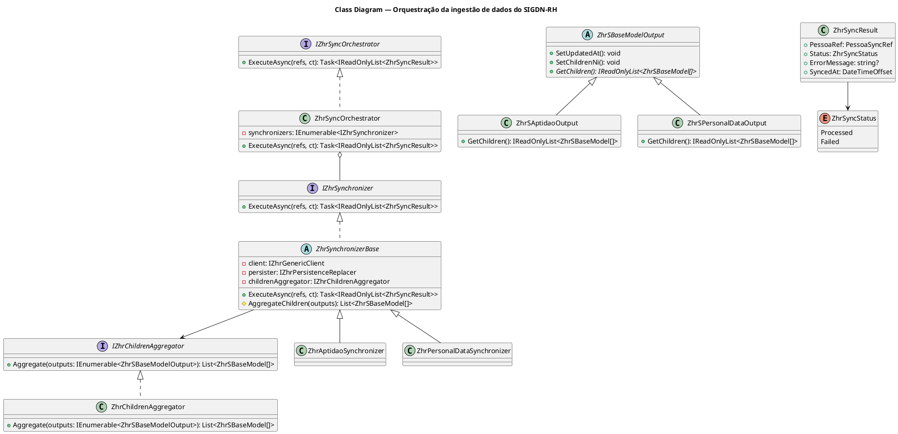
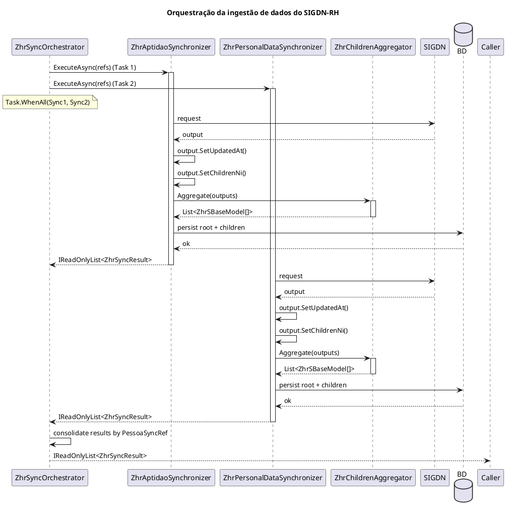

# ADR-002: Estratégia de orquestração da ingestão de dados do SIGDN-RH

## Status

Accepted

## Contexto

O componente Sync necessita de obter dados de múltiplos webservices do SIGDN-RH, normalizar os outputs e persistir os dados no schema de origem. É necessário decidir como organizar estas responsabilidades dentro do Orquestrador, onde vive a lógica de resolução de Ni, UpdatedAt, agregação de children, e como comunicar o resultado da sincronização ao caso de uso que invoca o orquestrador.

## Decisão

### 1. Orquestração "vertical" por webservice

Cada webservice é encapsulado num `IZhrSynchronizer` que coordena internamente o fetch, resolve o Ni e a data de atualização e persiste. O Orquestrador `ZhrSyncOrchestrator` executa os synchronizers sequencialmente ou de forma concorrente, dependendo da capacidade do SIGDN-RH em lidar com pedidos simultâneos.

### 2. Lógica de resolução na hierarquia de classes

A lógica de injecção de `Ni` nos children e marcação de `UpdatedAt` no root vive na classe base `ZhrSBaseModelOutput` através de três métodos:

- `SetUpdatedAt()` — marca o timestamp de actualização no root
- `GetChildren()` — abstracto, cada output concreto implementa devolvendo a sua estrutura de children
- `SetChildrenNi()` — injeta o `Ni` em todos os children usando `GetChildren()`

Cada partial concreta implementa apenas `GetChildren()`, sendo essa a sua única responsabilidade: conhecer e devolver a sua própria estrutura de children.

### 3. Agregação de children por tipo

Antes de persistir, os children de todos os outputs têm de ser agregados por tipo, sendo que cada tabela na BD corresponde a um tipo de child, não a um output. Para esta agregação, optou-se por um componente dedicado:

**Componente `ZhrChildrenAggregator`** — A lógica de agregação é extraída para um componente injectado no synchronizer. Testável isoladamente e mantém o synchronizer focado na orquestração.

**Motivação para a escolha:**

- A agregação por tipo é uma lógica reutilizável entre synchronizers
- Isola a complexidade de agrupamento e flattening num componente testável
- Mantém o synchronizer focado na orquestração (fetch + persistência)
- Facilita evolução futura se a lógica de agregação se tornar mais complexa

Foi introduzida a classe `ZhrSynchronizerBase` que contém a dependência do `IZhrChildrenAggregator` e disponibiliza o método `AggregateChildren()` para uso pelos synchronizers concretos.

### 4. Resultado da sincronização

O `IZhrSyncOrchestrator` retorna um resultado consolidado por `PessoaSyncRef`, sendo que o caso de uso que invoca o orquestrador não sabe quantos webservices existem nem quais falharam:

- `Processed` — todos os synchronizers sucederam para aquele `Ni`
- `Failed` — pelo menos um synchronizer falhou para aquele `Ni`

Assim, o `ZhrSyncOrchestrator` é responsável por consolidar os resultados de todos os `IZhrSynchronizer` antes de retornar ao caso de uso. Um `Ni` está sincronizado ou não, sendo que
não existe estado parcial do ponto de vista da lógica do negócio.

O contrato de retorno:

- `ZhrSyncResult` — resultado por `PessoaSyncRef` com estado, mensagem de erro opcional e timestamp de sincronização
- `ZhrSyncStatus` — `Processed` ou `Failed`

## Diagramas

### Diagrama de Classes

## Alternativas rejeitadas

**Componente externo `IZhrOutputResolver`** — rejeitado porque a lógica de injecção de `Ni` e marcação de `UpdatedAt` pertence ao modelo. `SetChildrenNi()` no root usa `GetChildren()` para injectar o `Ni` sem duplicação e sem componentes externos. As classes parciais permitem adicionar este comportamento sem tocar no código gerado pelo WCF.

**`GetChildren()` com lógica de `Ni` interna** — rejeitado porque mistura duas responsabilidades numa só operação. `GetChildren()` deve apenas devolver a estrutura de children, sendo a injecção do `Ni` responsabilidade de `SetChildrenNi()` no root.

**Agregação inline no synchronizer** — rejeitada porque a lógica de agregação por tipo é reutilizável entre synchronizers e merece um componente dedicado para melhor testabilidade e manutenção.

**Orquestração por Componentes Independentes** — rejeitada porque não existe uma forma limpa de associar `ZhrProvider1` ao `ZhrOutputResolver1` ao `ZhrPersister1` sem mecanismos de correlação frágeis. O encapsulamento no `IZhrSynchronizer` resolve este problema naturalmente.

## Consequências

- Novo webservice SIGDN acarreta novo `IZhrSynchronizer` + partial com `GetChildren()`, registado como DI
- `ZhrSyncOrchestrator` mantém-se estável independentemente do número de webservices
- `IZhrGenericClient` e `IZhrPersisterReplacer` são componentes partilhados injectados em cada synchronizer
- Testabilidade por synchronizer via mock de `IZhrGenericClient` e `IZhrPersisterReplacer`
- `GetChildren()` testável directamente nas classes do modelo sem dependências externas
- `ZhrChildrenAggregator` testável isoladamente
- Agregação de children por tipo é responsabilidade do `ZhrChildrenAggregator`, chamado pelo synchronizer antes de persistir

## Concorrência e Fiabilidade

A estratégia de orquestração recorre à execução paralela dos sincronizadores através de `Task.WhenAll`. Esta abordagem é segura e eficiente, com base nas seguintes premissas:

- Isolamento de Dados: Cada ZhrSyncronizer gere um grafo de entidades completamente independente. Não existem dependências cruzadas ou restrições de chaves estrangeiras entre as raízes processadas por diferentes instâncias do ZhrSyncronizer, eliminando assim o risco de race conditions na integridade referencial.

- Gestão de Recursos: Com um número de webservices na ordem das dezenas, a concorrência máxima está bem abaixo do limite configurado para o pool de ligações, garantindo que não
  ocorrem timeouts de ligação durante o pico de sincronização.

- Estratégia de Escrita: Para evitar conflitos de "Insert ou Update", o sistema utiliza um padrão de "Eliminação seguida de Inserção" (Delete-then-Insert). Isto assegura um estado limpo para cada conjunto de entidades e previne a violação de chaves primárias durante as escritas concorrentes.
