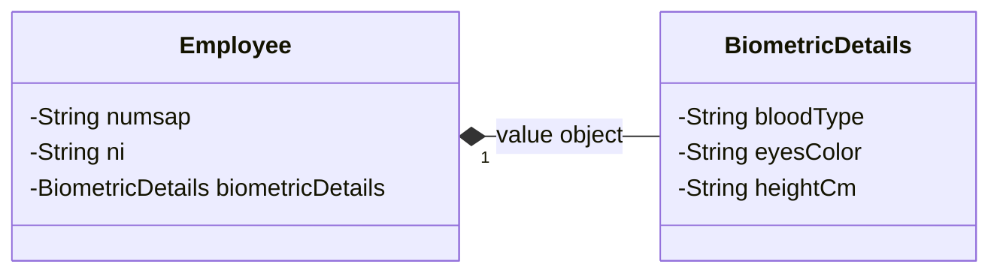

```mermaid
classDiagram
    direction LR
    Employee "1" *-- BiometricDetails : value object

class Employee {
  -String numsap
  -String ni
  -BiometricDetails biometricDetails
}

class BiometricDetails {
  -String bloodType
  -String eyesColor
  -String heightCm
}
```
