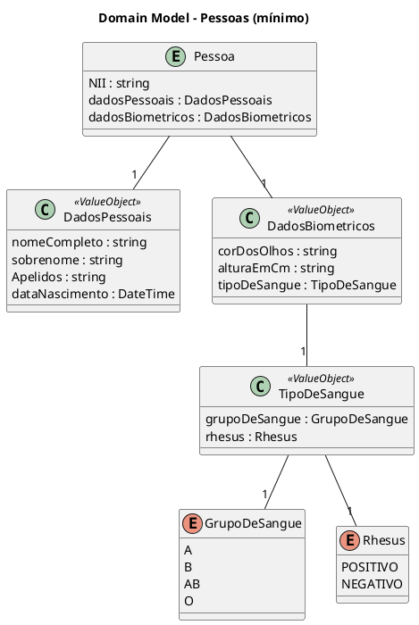

# Domain model

```plantuml
@startuml domain-model-pessoas

title Domain Model – Pessoas (mínimo)

Entity Pessoa {
  NII : string
  dadosPessoais : DadosPessoais
  dadosBiometricos : DadosBiometricos
}

class DadosPessoais << ValueObject >> {
  nomeCompleto : string
  sobrenome : string
  Apelidos : string
  dataNascimento : DateTime
}

class DadosBiometricos << ValueObject >> {
  corDosOlhos : string
  alturaEmCm : string
  tipoDeSangue : TipoDeSangue
}

class TipoDeSangue << ValueObject >>{
    grupoDeSangue : GrupoDeSangue
    rhesus : Rhesus
}

enum GrupoDeSangue {
    A
    B
    AB
    O
}

enum Rhesus {
    POSITIVO
    NEGATIVO
}

Pessoa -- "1" DadosPessoais
Pessoa -- "1" DadosBiometricos
DadosBiometricos -- "1" TipoDeSangue
TipoDeSangue -- "1" GrupoDeSangue
TipoDeSangue -- "1" Rhesus

@enduml
```
