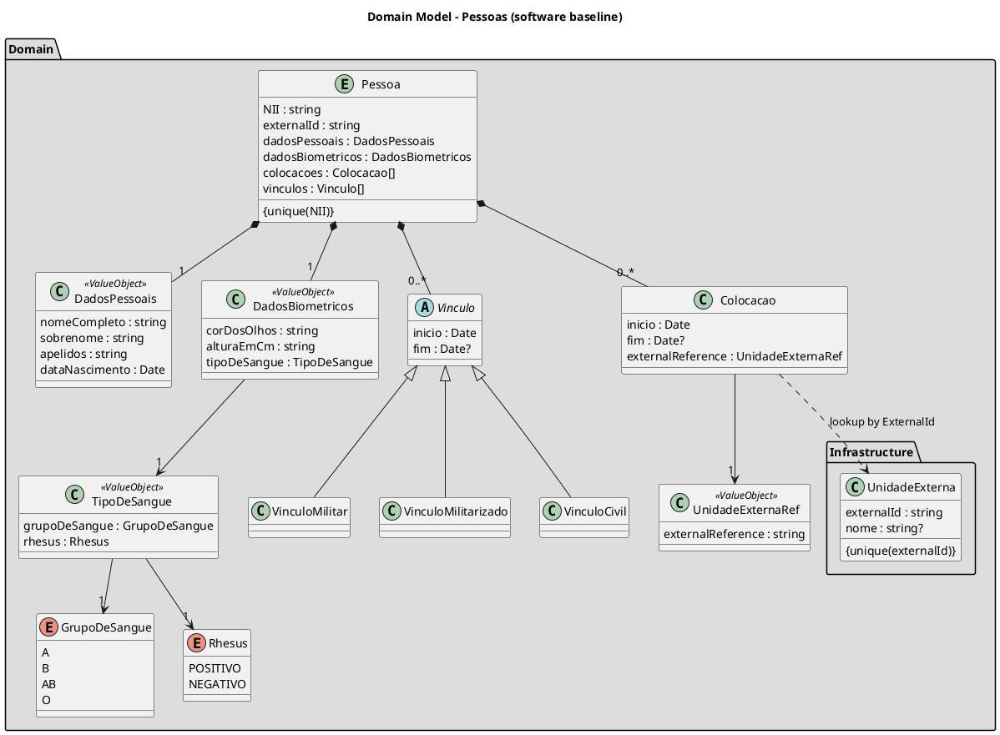

# Domain model

## Software engineering conventions

- Aggregate root: `Pessoa`
- Canonical domain identity: `NII` (unique)
- Integration identifier: `externalId` (not canonical for domain rules)
- Temporal model:
  - `dataNascimento` is a date-only value
  - `inicio` and `fim` are date-only validity boundaries
  - `fim` is optional for open-ended periods
- Invariants:
  - `NII` is mandatory and unique
  - if `fim` exists, then `fim >= inicio`
  - value objects are immutable and compared by value
  - UnidadeExterna `externalId` is the external system reference and must be unique

