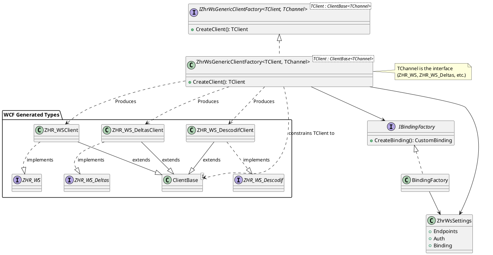

# Zhr WS Client Factory Class Diagram

```plantuml
@startuml ZHR WS Client Factory
title ZHR WS Client Factory Pattern Architecture

@startuml
skinparam classAttributeIconColor #black
skinparam nodesep 60
skinparam ranksep 60

' ========== CORE COMPONENTS ==========
' We add the technical constraint back into the label for accuracy
interface "IZhrWsGenericClientFactory<TClient, TChannel>\n<TClient : ClientBase<TChannel>>" as IClientFactory {
    + CreateClient(): TClient
}

class "ZhrWsGenericClientFactory<TClient, TChannel>\n<TClient : ClientBase<TChannel>>" as ClientFactory {
    + CreateClient(): TClient
}

interface IBindingFactory {
    + CreateBinding(): CustomBinding
}

class BindingFactory implements IBindingFactory

' ========== CONFIGURATION ==========
class ZhrWsSettings {
    + Endpoints
    + Auth
    + Binding
}

' ========== WCF GENERATED STACK ==========
package "WCF Generated Types" {
    interface ZHR_WS
    interface ZHR_WS_Deltas
    interface ZHR_WS_Descodif

    class ClientBase<T>

    class ZHR_WSClient
    class ZHR_WS_DeltasClient
    class ZHR_WS_DescodifClient

    ZHR_WSClient --|> ClientBase : "extends"
    ZHR_WSClient ..|> ZHR_WS : "implements"

    ZHR_WS_DeltasClient --|> ClientBase : "extends"
    ZHR_WS_DeltasClient ..|> ZHR_WS_Deltas : "implements"

    ZHR_WS_DescodifClient --|> ClientBase : "extends"
    ZHR_WS_DescodifClient ..|> ZHR_WS_Descodif : "implements"
}

' ========== RELATIONSHIPS ==========

IClientFactory <|.. ClientFactory

ClientFactory --> IBindingFactory
ClientFactory --> ZhrWsSettings
BindingFactory --> ZhrWsSettings

' This arrow explicitly links the Factory's TClient constraint to the ClientBase class
ClientFactory ..> ClientBase : "constrains TClient to"

' Production Flow
ClientFactory ..> ZHR_WSClient : "Produces"
ClientFactory ..> ZHR_WS_DeltasClient : "Produces"
ClientFactory ..> ZHR_WS_DescodifClient : "Produces"

note right of ClientFactory
  TChannel is the interface
  (ZHR_WS, ZHR_WS_Deltas, etc.)
end note
@enduml
```
