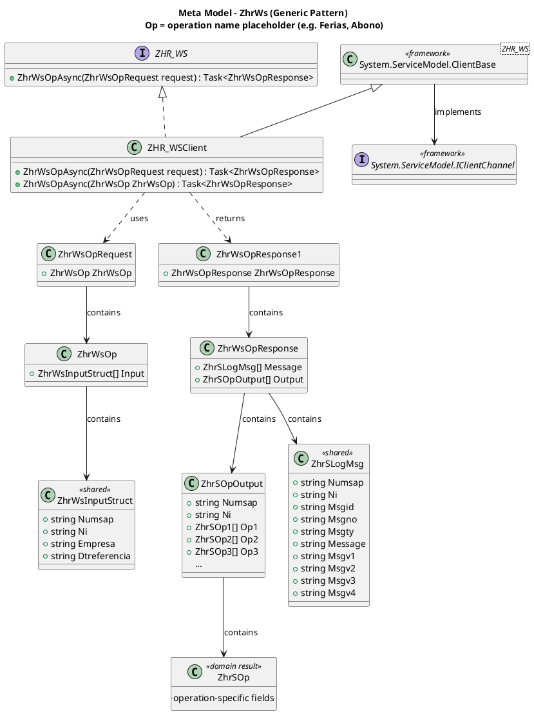

# Zhr Class diagram meta model

> Generic pattern for all ZHR Web Services. Replace `Op` with the concrete operation name (e.g. `Ferias`, `Apditao`, `AtribOrg`, etc.).

```plantuml
@startuml Zhr Class diagram meta model

title Meta Model - ZhrWs (Generic Pattern)\n Op = operation name placeholder (e.g. Ferias, Abono)

interface ZHR_WS {
  + ZhrWsOpAsync(ZhrWsOpRequest request) : Task<ZhrWsOpResponse>
}

interface "System.ServiceModel.IClientChannel" as IClientChannel <<framework>>

class "System.ServiceModel.ClientBase<ZHR_WS>" as ClientBaseZhrWs <<framework>>

class ZHR_WSClient extends ClientBaseZhrWs implements ZHR_WS {
  + ZhrWsOpAsync(ZhrWsOpRequest request) : Task<ZhrWsOpResponse>
  + ZhrWsOpAsync(ZhrWsOp ZhrWsOp) : Task<ZhrWsOpResponse>
}


class ZhrWsOp {
+ ZhrWsInputStruct[] Input
}

class ZhrWsInputStruct <<shared>> {
+ string Numsap
+ string Ni
+ string Empresa
+ string Dtreferencia
}

class ZhrSOp <<domain result>> {
.. operation-specific fields ..
}

class ZhrSOpOutput {
+ string Numsap
+ string Ni
+ ZhrSOp1[] Op1
+ ZhrSOp2[] Op2
+ ZhrSOp3[] Op3
...
}

class ZhrSLogMsg <<shared>> {
+ string Numsap
+ string Ni
+ string Msgid
+ string Msgno
+ string Msgty
+ string Message
+ string Msgv1
+ string Msgv2
+ string Msgv3
+ string Msgv4
}

class ZhrWsOpResponse {
+ ZhrSLogMsg[] Message
+ ZhrSOpOutput[] Output
}

class ZhrWsOpRequest {
+ ZhrWsOp ZhrWsOp
}

class ZhrWsOpResponse1 {
+ ZhrWsOpResponse ZhrWsOpResponse
}

ZhrWsOpRequest --> ZhrWsOp : contains
ZhrWsOp --> ZhrWsInputStruct : contains
ZhrWsOpResponse --> ZhrSLogMsg : contains
ZhrWsOpResponse --> ZhrSOpOutput : contains
ZhrSOpOutput --> ZhrSOp : contains
ZhrWsOpResponse1 --> ZhrWsOpResponse : contains
ZHR_WSClient ..> ZhrWsOpRequest : uses
ZHR_WSClient ..> ZhrWsOpResponse1 : returns

ClientBaseZhrWs --> IClientChannel : implements

@enduml
```
