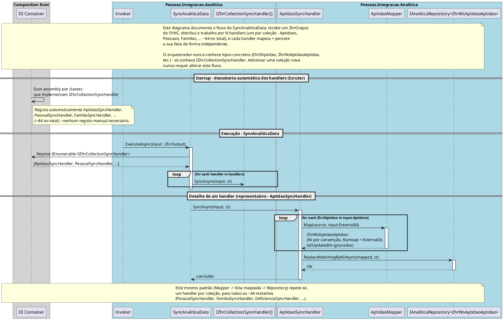

# Use Case - SyncAnaliticaData - Sequence Diagram

```plantuml
@startuml
note across
Este diagrama documenta o fluxo do SyncAnaliticaData: recebe um ZhrOutput
do SYNC, distribui o trabalho por N handlers (um por coleção - Aptidoes,
Pessoais, Familias, ... ~44 no total), e cada handler mapeia + persiste
a sua fatia de forma independente.

O orquestrador nunca conhece tipos concretos (ZhrSAptidao, ZhrWsAptidaoAptidao,
etc.) - só conhece IZhrCollectionSyncHandler. Adicionar uma coleção nova
nunca requer alterar este fluxo.
end note

== Startup - descoberta automática dos handlers (Scrutor) ==

box "Composition Root" #LightGray
    participant "DI Container" as DI
end box

DI -> DI : Scan assembly por classes\nque implementam IZhrCollectionSyncHandler
note right of DI
Regista automaticamente AptidaoSyncHandler,
PessoalSyncHandler, FamiliaSyncHandler, ...
(~44 no total) - nenhum registo manual necessário.
end note

== Execução - SyncAnaliticaData ==

box "Pessoas.Integracao.Analitica" #LightBlue
    participant "Invoker" as Caller
    participant "SyncAnaliticaData" as UseCase
    participant "IZhrCollectionSyncHandler[]" as Handlers
end box

Caller -> UseCase : ExecuteAsync(input : ZhrOutput)
activate UseCase

    UseCase -> DI : Resolve IEnumerable<IZhrCollectionSyncHandler>
    DI --> UseCase : [AptidaoSyncHandler, PessoalSyncHandler, ...]

    loop for each handler in handlers
        UseCase -> Handlers : SyncAsync(input, ct)
    end

deactivate UseCase

== Detalhe de um handler (representativo - AptidaoSyncHandler) ==

box "Pessoas.Integracao.Analitica" #LightBlue
    participant "AptidaoSyncHandler" as Handler
    participant "AptidaoMapper" as Mapper
    participant "IAnaliticaRepository<ZhrWsAptidaoAptidao>" as Repo
end box

UseCase -> Handler : SyncAsync(input, ct)
activate Handler

    loop for each ZhrSAptidao in input.Aptidoes
        Handler -> Mapper : Map(source, input.ExternalId)
        activate Mapper
        Mapper --> Handler : ZhrWsAptidaoAptidao\n(Ni por convenção, Numsap = ExternalId,\nId/UpdatedAt ignorados)
        deactivate Mapper
    end

    Handler -> Repo : ReplaceMatchingByNiAsync(mapped, ct)
    activate Repo
    Repo --> Handler : OK
    deactivate Repo

Handler --> UseCase : concluído
deactivate Handler

note across
Este mesmo padrão (Mapper -> lista mapeada -> Repository) repete-se,
um handler por coleção, para todas as ~44 restantes
(PessoalSyncHandler, FamiliaSyncHandler, DeficienciaSyncHandler, ...).
end note

@enduml
```
