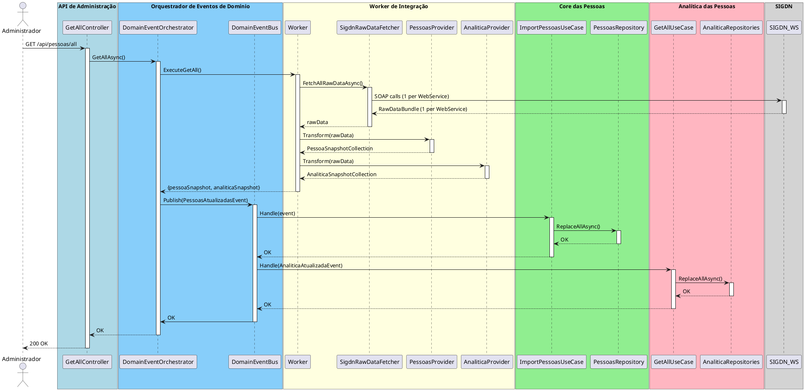

# Use Case - GetAll - Domain Event Approach - Sequence Diagram

```plantuml

@startuml

actor Admin as "Administrador"

box "API de Administração" #LightBlue
participant GetAllController
end box

box "Orquestrador de Eventos de Domínio" #LightSkyBlue
participant DomainEventOrchestrator
participant DomainEventBus
end box

box "Worker de Integração" #LightYellow
participant Worker
participant SigdnRawDataFetcher
participant PessoasProvider
participant AnaliticaProvider
end box

box "Core das Pessoas" #LightGreen
participant CoreUpdateHandler as "ImportPessoasUseCase"
participant OperacionalRepository as "PessoasRepository"
end box

box "Analítica das Pessoas" #LightPink
participant AnaliticaUpdateHandler as "GetAllUseCase"
participant AnaliticaRepository as "AnaliticaRepositories"
end box

box "SIGDN" #LightGray
participant SIGDN_WS
end box


Admin -> GetAllController : GET /api/pessoas/all
activate GetAllController

GetAllController -> DomainEventOrchestrator : GetAllAsync()
activate DomainEventOrchestrator

DomainEventOrchestrator -> Worker : ExecuteGetAll()
activate Worker

Worker -> SigdnRawDataFetcher : FetchAllRawDataAsync()
activate SigdnRawDataFetcher

SigdnRawDataFetcher -> SIGDN_WS : SOAP calls (1 per WebService)
activate SIGDN_WS
SIGDN_WS --> SigdnRawDataFetcher : RawDataBundle (1 per WebService)
deactivate SIGDN_WS

SigdnRawDataFetcher --> Worker : rawData
deactivate SigdnRawDataFetcher

Worker -> PessoasProvider : Transform(rawData)
activate PessoasProvider
PessoasProvider --> Worker : PessoaSnapshotCollection
deactivate PessoasProvider

Worker -> AnaliticaProvider : Transform(rawData)
activate AnaliticaProvider
AnaliticaProvider --> Worker : AnaliticaSnapshotCollection
deactivate AnaliticaProvider

Worker --> DomainEventOrchestrator : {pessoaSnapshot, analiticaSnapshot}
deactivate Worker

' --- Publica eventos ---
DomainEventOrchestrator -> DomainEventBus : Publish(PessoasAtualizadasEvent)
activate DomainEventBus
DomainEventBus -> CoreUpdateHandler : Handle(event)
activate CoreUpdateHandler

CoreUpdateHandler -> OperacionalRepository : ReplaceAllAsync()
activate OperacionalRepository
OperacionalRepository --> CoreUpdateHandler : OK
deactivate OperacionalRepository

CoreUpdateHandler --> DomainEventBus : OK
deactivate CoreUpdateHandler

DomainEventBus -> AnaliticaUpdateHandler : Handle(AnaliticaAtualizadaEvent)
activate AnaliticaUpdateHandler

AnaliticaUpdateHandler -> AnaliticaRepository : ReplaceAllAsync()
activate AnaliticaRepository
AnaliticaRepository --> AnaliticaUpdateHandler : OK
deactivate AnaliticaRepository

AnaliticaUpdateHandler --> DomainEventBus : OK
deactivate AnaliticaUpdateHandler

DomainEventBus -> DomainEventOrchestrator : OK
deactivate DomainEventBus

DomainEventOrchestrator --> GetAllController : OK
deactivate DomainEventOrchestrator

GetAllController --> Admin : 200 OK
deactivate GetAllController

@enduml
```
