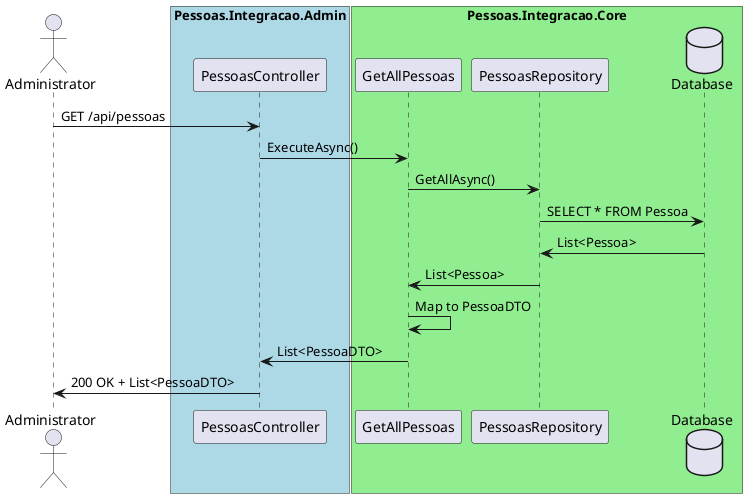

# Use Case - GetAllPessoas - Sequence Diagram

```plantuml

@startuml
actor Administrator as Admin

box "Pessoas.Integracao.Admin" #LightBlue
participant PessoasController
end box

box "Pessoas.Integracao.Core" #LightGreen
participant GetAllPessoas
participant PessoasRepository
database Database
end box

Admin -> PessoasController : GET /api/pessoas
PessoasController -> GetAllPessoas : ExecuteAsync()
GetAllPessoas -> PessoasRepository : GetAllAsync()
PessoasRepository -> Database : SELECT * FROM Pessoa
Database -> PessoasRepository : List<Pessoa>
PessoasRepository -> GetAllPessoas : List<Pessoa>
GetAllPessoas -> GetAllPessoas : Map to PessoaDTO
GetAllPessoas -> PessoasController: List<PessoaDTO>
PessoasController -> Admin : 200 OK + List<PessoaDTO>
@enduml

```
