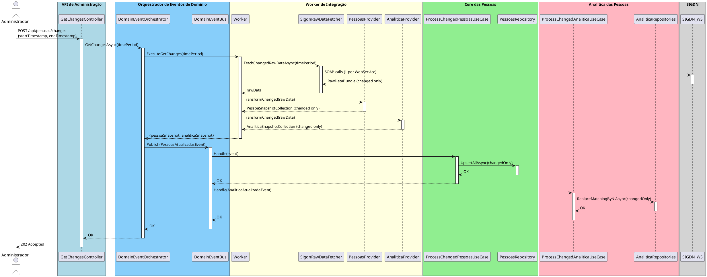

# Use Case - GetChanges - Domain Event Approach - Sequence Diagram

```plantuml

@startuml

actor Admin as "Administrador"

box "API de Administração" #LightBlue
participant GetChangesController
end box

box "Orquestrador de Eventos de Domínio" #LightSkyBlue
participant DomainEventOrchestrator
participant DomainEventBus
end box

box "Worker de Integração" #LightYellow
participant Worker
participant SigdnRawDataFetcher
participant PessoasProvider
participant AnaliticaProvider
end box

box "Core das Pessoas" #LightGreen
participant CoreUpdateHandler as "ProcessChangedPessoasUseCase"
participant OperacionalRepository as "PessoasRepository"
end box

box "Analítica das Pessoas" #LightPink
participant AnaliticaUpdateHandler as "ProcessChangedAnaliticaUseCase"
participant AnaliticaRepository as "AnaliticaRepositories"
end box

box "SIGDN" #LightGray
participant SIGDN_WS
end box


Admin -> GetChangesController : POST /api/pessoas/changes\n{startTimestamp, endTimestamp}
activate GetChangesController

GetChangesController -> DomainEventOrchestrator : GetChangesAsync(timePeriod)
activate DomainEventOrchestrator

DomainEventOrchestrator -> Worker : ExecuteGetChanges(timePeriod)
activate Worker

Worker -> SigdnRawDataFetcher : FetchChangedRawDataAsync(timePeriod)
activate SigdnRawDataFetcher

SigdnRawDataFetcher -> SIGDN_WS : SOAP calls (1 per WebService)
activate SIGDN_WS
SIGDN_WS --> SigdnRawDataFetcher : RawDataBundle (changed only)
deactivate SIGDN_WS

SigdnRawDataFetcher --> Worker : rawData
deactivate SigdnRawDataFetcher

Worker -> PessoasProvider : TransformChanged(rawData)
activate PessoasProvider
PessoasProvider --> Worker : PessoaSnapshotCollection (changed only)
deactivate PessoasProvider

Worker -> AnaliticaProvider : TransformChanged(rawData)
activate AnaliticaProvider
AnaliticaProvider --> Worker : AnaliticaSnapshotCollection (changed only)
deactivate AnaliticaProvider

Worker --> DomainEventOrchestrator : {pessoaSnapshot, analiticaSnapshot}
deactivate Worker

' --- Publica eventos ---
DomainEventOrchestrator -> DomainEventBus : Publish(PessoasAtualizadasEvent)
activate DomainEventBus
DomainEventBus -> CoreUpdateHandler : Handle(event)
activate CoreUpdateHandler

CoreUpdateHandler -> OperacionalRepository : UpsertAllAsync(changedOnly)
activate OperacionalRepository
OperacionalRepository --> CoreUpdateHandler : OK
deactivate OperacionalRepository

CoreUpdateHandler --> DomainEventBus : OK
deactivate CoreUpdateHandler

DomainEventBus -> AnaliticaUpdateHandler : Handle(AnaliticaAtualizadaEvent)
activate AnaliticaUpdateHandler

AnaliticaUpdateHandler -> AnaliticaRepository : ReplaceMatchingByNiAsync(changedOnly)
activate AnaliticaRepository
AnaliticaRepository --> AnaliticaUpdateHandler : OK
deactivate AnaliticaRepository

AnaliticaUpdateHandler --> DomainEventBus : OK
deactivate AnaliticaUpdateHandler

DomainEventBus --> DomainEventOrchestrator : OK
deactivate DomainEventBus

DomainEventOrchestrator --> GetChangesController : OK
deactivate DomainEventOrchestrator

GetChangesController --> Admin : 202 Accepted
deactivate GetChangesController

@enduml
```
