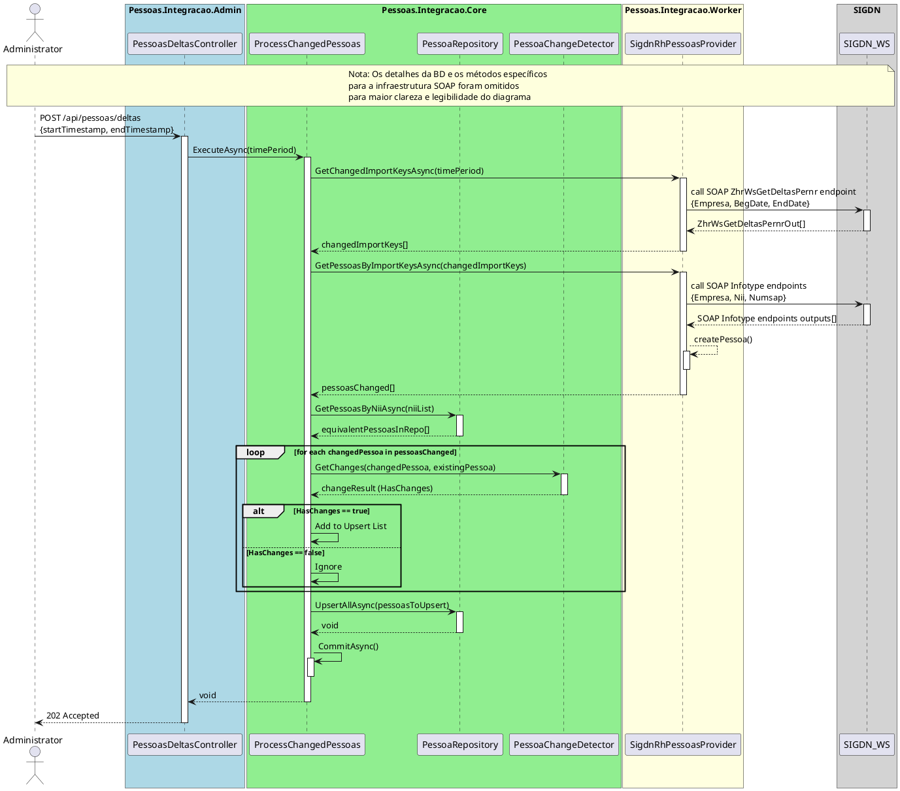

# Use Case - GetDeltas - Sequence Diagram

```plantuml

@startuml

note across
    Nota: Os detalhes da BD e os métodos específicos
    para a infraestrutura SOAP foram omitidos
    para maior clareza e legibilidade do diagrama
end note

actor Administrator as Admin

box "Pessoas.Integracao.Admin" #LightBlue
participant PessoasDeltasController
end box


box "Pessoas.Integracao.Core" #LightGreen
participant ProcessChangedPessoas
participant PessoaRepository
participant PessoaChangeDetector
end box

box "Pessoas.Integracao.Worker" #LightYellow
participant SigdnRhPessoasProvider
end box

box "SIGDN" #LightGray
participant SIGDN_WS
end box


Admin -> PessoasDeltasController : POST /api/pessoas/deltas \n{startTimestamp, endTimestamp}
activate PessoasDeltasController

PessoasDeltasController -> ProcessChangedPessoas : ExecuteAsync(timePeriod)
activate ProcessChangedPessoas

ProcessChangedPessoas -> SigdnRhPessoasProvider : GetChangedImportKeysAsync(timePeriod)
activate SigdnRhPessoasProvider

SigdnRhPessoasProvider -> SIGDN_WS : call SOAP ZhrWsGetDeltasPernr endpoint\n{Empresa, BegDate, EndDate}
activate SIGDN_WS

SIGDN_WS --> SigdnRhPessoasProvider : ZhrWsGetDeltasPernrOut[]
deactivate SIGDN_WS

SigdnRhPessoasProvider --> ProcessChangedPessoas : changedImportKeys[]
deactivate SigdnRhPessoasProvider

ProcessChangedPessoas -> SigdnRhPessoasProvider : GetPessoasByImportKeysAsync(changedImportKeys)
activate SigdnRhPessoasProvider

SigdnRhPessoasProvider -> SIGDN_WS : call SOAP Infotype endpoints\n{Empresa, Nii, Numsap}
activate SIGDN_WS
SIGDN_WS --> SigdnRhPessoasProvider : SOAP Infotype endpoints outputs[]
deactivate SIGDN_WS

SigdnRhPessoasProvider --> SigdnRhPessoasProvider : createPessoa()
activate SigdnRhPessoasProvider
deactivate SigdnRhPessoasProvider

SigdnRhPessoasProvider --> ProcessChangedPessoas : pessoasChanged[]
deactivate SigdnRhPessoasProvider

ProcessChangedPessoas -> PessoaRepository : GetPessoasByNiiAsync(niiList)
activate PessoaRepository
PessoaRepository --> ProcessChangedPessoas : equivalentPessoasInRepo[]
deactivate PessoaRepository

loop for each changedPessoa in pessoasChanged

    ProcessChangedPessoas -> PessoaChangeDetector : GetChanges(changedPessoa, existingPessoa)
    activate PessoaChangeDetector
    PessoaChangeDetector --> ProcessChangedPessoas : changeResult (HasChanges)
    deactivate PessoaChangeDetector

    alt HasChanges == true
        ProcessChangedPessoas -> ProcessChangedPessoas : Add to Upsert List
    else HasChanges == false
        ProcessChangedPessoas -> ProcessChangedPessoas : Ignore
    end

end

ProcessChangedPessoas -> PessoaRepository : UpsertAllAsync(pessoasToUpsert)
activate PessoaRepository
PessoaRepository --> ProcessChangedPessoas : void
deactivate PessoaRepository

ProcessChangedPessoas -> ProcessChangedPessoas : CommitAsync()
activate ProcessChangedPessoas
deactivate ProcessChangedPessoas

ProcessChangedPessoas --> PessoasDeltasController: void
deactivate ProcessChangedPessoas

PessoasDeltasController --> Admin : 202 Accepted
deactivate PessoasDeltasController

@enduml

```
