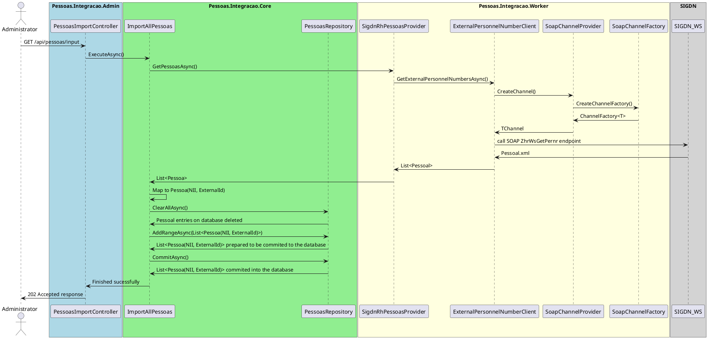

# Use Case - ImportAllPessoas - Sequence Diagram

```plantuml

@startuml

actor Administrator as Admin

box "Pessoas.Integracao.Admin" #LightBlue
participant PessoasImportController
end box


box "Pessoas.Integracao.Core" #LightGreen
participant ImportAllPessoas
participant PessoasRepository
end box

box "Pessoas.Integracao.Worker" #LightYellow
participant SigdnRhPessoasProvider
participant ExternalPersonnelNumberClient
participant SoapChannelProvider
participant SoapChannelFactory
end box

box "SIGDN" #LightGray
participant SIGDN_WS
end box


Admin -> PessoasImportController : GET /api/pessoas/input
PessoasImportController -> ImportAllPessoas : ExecuteAsync()

ImportAllPessoas -> SigdnRhPessoasProvider : GetPessoasAsync()
SigdnRhPessoasProvider -> ExternalPersonnelNumberClient : GetExternalPersonnelNumbersAsync()
ExternalPersonnelNumberClient -> SoapChannelProvider : CreateChannel()
SoapChannelProvider -> SoapChannelFactory : CreateChannelFactory()
SoapChannelFactory -> SoapChannelProvider : ChannelFactory<T>
SoapChannelProvider -> ExternalPersonnelNumberClient : TChannel
ExternalPersonnelNumberClient -> SIGDN_WS : call SOAP ZhrWsGetPernr endpoint
SIGDN_WS -> ExternalPersonnelNumberClient : Pessoal.xml
ExternalPersonnelNumberClient -> SigdnRhPessoasProvider : List<Pessoal>
SigdnRhPessoasProvider -> ImportAllPessoas : List<Pessoa>
ImportAllPessoas -> ImportAllPessoas : Map to Pessoa(NII, ExternalId)

ImportAllPessoas -> PessoasRepository : ClearAllAsync()
PessoasRepository -> ImportAllPessoas : Pessoal entries on database deleted

ImportAllPessoas -> PessoasRepository : AddRangeAsync(List<Pessoa(NII, ExternalId)>)
PessoasRepository -> ImportAllPessoas : List<Pessoa(NII, ExternalId)> prepared to be commited to the database

ImportAllPessoas -> PessoasRepository : CommitAsync()
PessoasRepository -> ImportAllPessoas : List<Pessoa(NII, ExternalId)> commited into the database

ImportAllPessoas -> PessoasImportController: Finished sucessfully

PessoasImportController -> Admin : 202 Accepted response

@enduml

```
