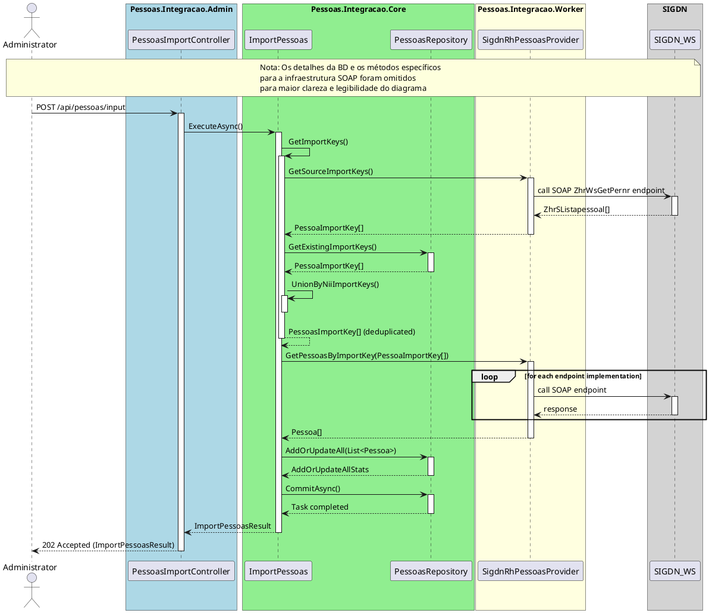

# Use Case - ImportPessoas - Sequence Diagram

```plantuml

@startuml

note across
    Nota: Os detalhes da BD e os métodos específicos
    para a infraestrutura SOAP foram omitidos
    para maior clareza e legibilidade do diagrama
end note

actor Administrator as Admin

box "Pessoas.Integracao.Admin" #LightBlue
participant PessoasImportController
end box


box "Pessoas.Integracao.Core" #LightGreen
participant ImportPessoas
participant PessoasRepository
end box

box "Pessoas.Integracao.Worker" #LightYellow
participant SigdnRhPessoasProvider
end box

box "SIGDN" #LightGray
participant SIGDN_WS
end box


Admin -> PessoasImportController : POST /api/pessoas/input
activate PessoasImportController

PessoasImportController -> ImportPessoas : ExecuteAsync()
activate ImportPessoas

ImportPessoas -> ImportPessoas : GetImportKeys()
activate ImportPessoas

ImportPessoas -> SigdnRhPessoasProvider : GetSourceImportKeys()
activate SigdnRhPessoasProvider
SigdnRhPessoasProvider -> SIGDN_WS : call SOAP ZhrWsGetPernr endpoint
activate SIGDN_WS
SIGDN_WS --> SigdnRhPessoasProvider : ZhrSListapessoal[]
deactivate SIGDN_WS
SigdnRhPessoasProvider --> ImportPessoas : PessoaImportKey[]
deactivate SigdnRhPessoasProvider

ImportPessoas -> PessoasRepository : GetExistingImportKeys()
activate PessoasRepository
PessoasRepository --> ImportPessoas : PessoaImportKey[]
deactivate PessoasRepository

ImportPessoas -> ImportPessoas : UnionByNiiImportKeys()
activate ImportPessoas
deactivate ImportPessoas

ImportPessoas --> ImportPessoas : PessoasImportKey[] (deduplicated)
deactivate ImportPessoas

ImportPessoas -> SigdnRhPessoasProvider : GetPessoasByImportKey(PessoaImportKey[])
activate SigdnRhPessoasProvider

loop for each endpoint implementation
    SigdnRhPessoasProvider -> SIGDN_WS : call SOAP endpoint
    activate SIGDN_WS
    SIGDN_WS --> SigdnRhPessoasProvider : response
    deactivate SIGDN_WS
end

SigdnRhPessoasProvider --> ImportPessoas : Pessoa[]
deactivate SigdnRhPessoasProvider

ImportPessoas -> PessoasRepository : AddOrUpdateAll(List<Pessoa>)
activate PessoasRepository
PessoasRepository --> ImportPessoas : AddOrUpdateAllStats
deactivate PessoasRepository

ImportPessoas -> PessoasRepository : CommitAsync()
activate PessoasRepository
PessoasRepository --> ImportPessoas : Task completed
deactivate PessoasRepository

ImportPessoas --> PessoasImportController: ImportPessoasResult
deactivate ImportPessoas

PessoasImportController --> Admin : 202 Accepted (ImportPessoasResult)
deactivate PessoasImportController

@enduml

```
