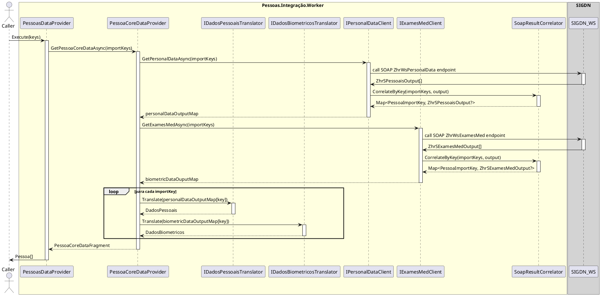

# Use Case - PessoasCoreDataProvider - Sequence Diagram

```plantuml

@startuml

actor Caller as "Caller"

box "Pessoas.Integração.Worker" #LightYellow
participant PessoasDataProvider
participant PessoaCoreDataProvider
participant IDadosPessoaisTranslator
participant IDadosBiometricosTranslator
participant IPersonalDataClient
participant IExamesMedClient
participant SoapResultCorrelator
end box

box "SIGDN" #LightGray
participant SIGDN_WS as "SIGDN_WS"
end box

Caller -> PessoasDataProvider : Execute(keys)
activate PessoasDataProvider

PessoasDataProvider -> PessoaCoreDataProvider : GetPessoaCoreDataAsync(importKeys)
activate PessoaCoreDataProvider

PessoaCoreDataProvider -> IPersonalDataClient : GetPersonalDataAsync(importKeys)
activate IPersonalDataClient

IPersonalDataClient -> SIGDN_WS : call SOAP ZhrWsPersonalData endpoint
activate SIGDN_WS

SIGDN_WS -> IPersonalDataClient :  ZhrSPessoaisOutput[]
deactivate SIGDN_WS

IPersonalDataClient -> SoapResultCorrelator : CorrelateByKey(importKeys, output)
activate SoapResultCorrelator

SoapResultCorrelator --> IPersonalDataClient : Map<PessoaImportKey, ZhrSPessoaisOutput?>
deactivate SoapResultCorrelator

IPersonalDataClient --> PessoaCoreDataProvider : personalDataOutputMap
deactivate IPersonalDataClient


PessoaCoreDataProvider -> IExamesMedClient : GetExamesMedAsync(importKeys)
activate IExamesMedClient

IExamesMedClient -> SIGDN_WS : call SOAP ZhrWsExamesMed endpoint
activate SIGDN_WS

SIGDN_WS -> IExamesMedClient :  ZhrSExamesMedOutput[]
deactivate SIGDN_WS

IExamesMedClient -> SoapResultCorrelator : CorrelateByKey(importKeys, output)
activate SoapResultCorrelator

SoapResultCorrelator --> IExamesMedClient : Map<PessoaImportKey, ZhrSExamesMedOutput?>
deactivate SoapResultCorrelator

IExamesMedClient --> PessoaCoreDataProvider : biometricDataOuputMap
deactivate IExamesMedClient


loop para cada importKey
    PessoaCoreDataProvider -> IDadosPessoaisTranslator : Translate(personalDataOutputMap[key])
    activate IDadosPessoaisTranslator

    IDadosPessoaisTranslator --> PessoaCoreDataProvider : DadosPessoais
    deactivate IDadosPessoaisTranslator


    PessoaCoreDataProvider -> IDadosBiometricosTranslator : Translate(biometricDataOutputMap[key])
    activate IDadosBiometricosTranslator

    IDadosBiometricosTranslator --> PessoaCoreDataProvider : DadosBiometricos
    deactivate IDadosBiometricosTranslator
end

PessoaCoreDataProvider --> PessoasDataProvider : PessoaCoreDataFragment
deactivate PessoaCoreDataProvider

PessoasDataProvider -> Caller : Pessoa[]
deactivate PessoasDataProvider

@enduml

```
