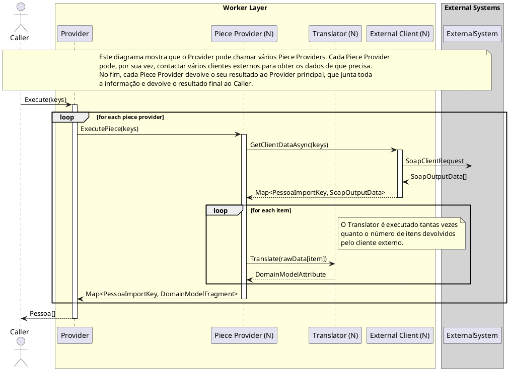

# Use Case - Generic Provider - Sequence Diagram

```plantuml

@startuml

note across
Este diagrama mostra que o Provider pode chamar vários Piece Providers. Cada Piece Provider
pode, por sua vez, contactar vários clientes externos para obter os dados de que precisa.
No fim, cada Piece Provider devolve o seu resultado ao Provider principal, que junta toda
a informação e devolve o resultado final ao Caller.
end note

actor Caller as "Caller"

box "Worker Layer" #LightYellow
participant Provider
participant PieceProvider as "Piece Provider (N)"
participant Translator as "Translator (N)"
participant ExternalClient as "External Client (N)"
end box

box "External Systems" #LightGray
participant ExternalSystem
end box

Caller -> Provider : Execute(keys)
activate Provider

loop for each piece provider
    Provider -> PieceProvider : ExecutePiece(keys)
    activate PieceProvider

    PieceProvider -> ExternalClient : GetClientDataAsync(keys)
    activate ExternalClient

    ExternalClient -> ExternalSystem : SoapClientRequest
    ExternalSystem --> ExternalClient : SoapOutputData[]
    deactivate ExternalSystem

    ExternalClient --> PieceProvider : Map<PessoaImportKey, SoapOutputData>
    deactivate ExternalClient

    loop for each item
        note right of Translator
        O Translator é executado tantas vezes
        quanto o número de itens devolvidos
        pelo cliente externo.
        end note

        PieceProvider -> Translator : Translate(rawData[item])
        Translator --> PieceProvider : DomainModelAttribute
        deactivate Translator
    end

    PieceProvider --> Provider : Map<PessoaImportKey, DomainModelFragment>
    deactivate PieceProvider
end

Provider --> Caller : Pessoa[]
deactivate Provider

@enduml

```
